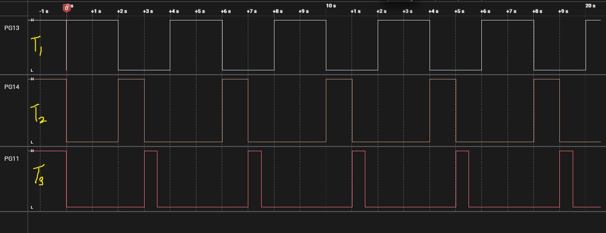

### Example 1 – Simple Task-to-Task Notification (Semaphore Replacement)

```c
/* *************************** Task Handles ******************************* */
TaskHandle_t Task01_Handle;
TaskHandle_t Task02_Handle;
TaskHandle_t Task03_Handle;

/* *************************** Task Functions ***************************** */
void Task01(void* pvParameters)
{
	for(;;)
	{
		xTaskNotifyGive(Task02_Handle);
		HAL_GPIO_TogglePin(GPIOG, GPIO_PIN_13);
		HAL_UART_Transmit(&huart1, (uint8_t *)"Task 1: Notification Sent\n", 27, HAL_MAX_DELAY);

		vTaskDelay(1000);
	}
}

void Task02(void* pvParameters)
{
	for(;;)
	{
		ulTaskNotifyTake(pdTRUE, portMAX_DELAY);
		xTaskNotifyGive(Task03_Handle);
		HAL_GPIO_TogglePin(GPIOG, GPIO_PIN_14);
		HAL_UART_Transmit(&huart1, (uint8_t*) "Task 2: Notification Received\n", 30, HAL_MAX_DELAY);
	}
}

void Task03(void* pvParameters)
{
	for(;;)
	{
		ulTaskNotifyTake(pdTRUE, portMAX_DELAY);
		HAL_GPIO_TogglePin(GPIOG, GPIO_PIN_11);
		HAL_UART_Transmit(&huart1, (uint8_t*) "Task 3: Notification Received\n", 30, HAL_MAX_DELAY);
	}
}

int main(void)
{
    // ....

    /* ********************** Create Tasks ************************ */
    xTaskCreate(Task01, "T1", 128, NULL, 2, &Task01_Handle);
    xTaskCreate(Task02, "T2", 128, NULL, 1, &Task02_Handle);
    xTaskCreate(Task03, "T3", 128, NULL, 0, &Task03_Handle);

    /* ********************** Start Scheduler *********************** */
    vTaskStartScheduler();
}
```



```
Task 1: Notification Sent
Task 2: Notification Received
Task 3: Notification Received
Task 1: Notification Sent
Task 2: Notification Received
Task 3: Notification Received
Task 1: Notification Sent
Task 2: Notification Received
Task 3: Notification Received
Task 1: Notification Sent
Task 2: Notification Received
Task 3: Notification Received
Task 1: Notification Sent
Task 2: Notification Received
Task 3: Notification Received
Task 1: Notification Sent
Task 2: Notification Received
Task 3: Notification Received
Task 1: Notification Sent
Task 2: Notification Received
Task 3: Notification Received
Task 1: Notification Sent
Task 2: Notification Received
Task 3: Notification Received
Task 1: Notification Sent
Task 2: Notification Received
Task 3: Notification Received
```

### Example 2 – ISR-to-Task Notification (Fast Signal Passing)

```C

/* *************************** Task Handles ******************************* */
TaskHandle_t Task01_Handle;

/* *************************** Task Functions ***************************** */
void Task01(void* pvParameters)
{
	for(;;)
	{
		ulTaskNotifyTake(pdTRUE, portMAX_DELAY);
		HAL_GPIO_TogglePin(GPIOG, GPIO_PIN_13);
		HAL_UART_Transmit(&huart1, (uint8_t *)"Task 1: Notification Sent\n", 27, HAL_MAX_DELAY);

		vTaskDelay(1000);
	}
}

void HAL_GPIO_EXTI_Callback(uint16_t GPIO_Pin)
{
  if(GPIO_Pin == GPIO_PIN_0)
  {
	BaseType_t xHigherPriorityTaskWoken = pdFALSE;
	HAL_GPIO_TogglePin(GPIOG, GPIO_PIN_14);
	vTaskNotifyGiveFromISR(Task01_Handle, &xHigherPriorityTaskWoken);

	portYIELD_FROM_ISR(xHigherPriorityTaskWoken);
  }
}
```


```
Task 1: Notification Sent
Task 1: Notification Sent
Task 1: Notification Sent
Task 1: Notification Sent
```

### Example 3 – Task Notification as an Event Counter

```c

/* *************************** Task Handles ******************************* */
TaskHandle_t Task01_Handle;

/* *************************** Task Functions ***************************** */
void Task01(void* pvParameters)
{
	uint32_t notificationValue = 0;
	for(;;)
	{

		// Block here until at least one notification is pending
		xTaskNotifyWait(pdFALSE, pdFALSE, &notificationValue, portMAX_DELAY);

		// notificationValue tells how many times ISR triggered since last check
		char str[50];
		sprintf(str, "Task01: Received %lu notifications from ISR\n", notificationValue);
		HAL_UART_Transmit(&huart1, (uint8_t*)str, strlen(str), HAL_MAX_DELAY);

		HAL_GPIO_TogglePin(GPIOG, GPIO_PIN_13);
	}
}

void HAL_GPIO_EXTI_Callback(uint16_t GPIO_Pin)
{
  if(GPIO_Pin == GPIO_PIN_0)
  {
	BaseType_t xHigherPriorityTaskWoken = pdFALSE;
	HAL_GPIO_TogglePin(GPIOG, GPIO_PIN_14);

	xTaskNotifyFromISR(Task01_Handle, 0, eIncrement, &xHigherPriorityTaskWoken); // Increment notification value by 1


	portYIELD_FROM_ISR(xHigherPriorityTaskWoken);
  }
}
```
```
Task01: Received 1 notifications from ISR
Task01: Received 2 notifications from ISR
Task01: Received 3 notifications from ISR
Task01: Received 4 notifications from ISR
Task01: Received 5 notifications from ISR
Task01: Received 6 notifications from ISR
Task01: Received 7 notifications from ISR
```


### Example 4 - Sending Data with Task Notifications

```c
uint32_t txValue = 100;

/* *************************** Task Handles ******************************* */
TaskHandle_t Task01_Handle;

/* *************************** Task Functions ***************************** */
void Task01(void* pvParameters)
{
	uint32_t notificationValue = 0;
	for(;;)
	{

		// Block here until at least one notification is pending
		xTaskNotifyWait(pdFALSE, pdFALSE, &notificationValue, portMAX_DELAY);

		// notificationValue tells how many times ISR triggered since last check
		char str[50];
		sprintf(str, "Task01: Received %lu notifications from ISR\n", notificationValue);
		HAL_UART_Transmit(&huart1, (uint8_t*)str, strlen(str), HAL_MAX_DELAY);


		HAL_GPIO_TogglePin(GPIOG, GPIO_PIN_13);
	}
}

void HAL_GPIO_EXTI_Callback(uint16_t GPIO_Pin)
{
  if(GPIO_Pin == GPIO_PIN_0)
  {
	BaseType_t xHigherPriorityTaskWoken = pdFALSE;
	HAL_GPIO_TogglePin(GPIOG, GPIO_PIN_14);

	xTaskNotifyFromISR(Task01_Handle, txValue, eSetValueWithOverwrite, &xHigherPriorityTaskWoken); // Set notification value to txValue
	txValue++;

	portYIELD_FROM_ISR(xHigherPriorityTaskWoken);
  }
}
```

```
Task01: Received 100 notifications from ISR
Task01: Received 101 notifications from ISR
Task01: Received 102 notifications from ISR
Task01: Received 103 notifications from ISR
Task01: Received 104 notifications from ISR
Task01: Received 105 notifications from ISR
Task01: Received 106 notifications from ISR
```