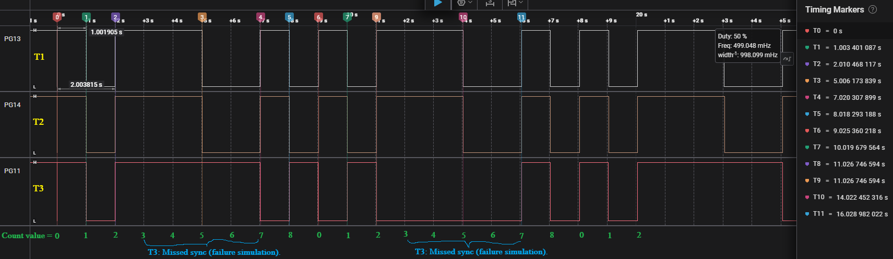

# Event Groups

* An event group is just a collection of bits.
* Tasks can wait on one or more bits to be set.
* Tasks can wait for any one bit (OR condition) or for all bits together (AND condition).
* Useful for synchronization between multiple tasks and ISRs.

### Example 01 (xEventGroupWaitBits)

This example demonstrates how to use FreeRTOS Event Groups to monitor multiple tasks, acting like a simple software watchdog.

🔹 Concept

* Each task sets its own event bit in the event group when it runs.
* A dedicated watchdog task (Tasks_WatchDog) waits until all bits are set within a given timeout (2 seconds).
* If all bits are set → watchdog reports "All tasks are running".
* If one or more bits are missing after the timeout → watchdog identifies which task(s) failed.
* This way, the watchdog ensures that all tasks are “alive” and reporting regularly.

🔹 Task Behavior

* **Task01**: Toggles LED on PG13, sets task01_id every 1 s.
* **Task02**: Toggles LED on PG14, sets task02_id every 1 s.
* **Task03**: Toggles LED on PG11, sets task03_id every 1 s — except between counts 4–9 (simulating a task failure).
* **Watchdog Task**:
    * Waits up to 2 s for all three bits (task01_id | task02_id | task03_id).
    * Uses auto-clear so it checks fresh bits each cycle.
    * Reports status via UART.

```c
/* ********************* Task Handles *************************************** */
TaskHandle_t Task01Handle = NULL;
TaskHandle_t Task02Handle = NULL;
TaskHandle_t Task03Handle = NULL;

TaskHandle_t Tasks_WatchDogHandle = NULL;

/* ********************* Event Group Handle ********************************** */
EventGroupHandle_t EventHandle;

const uint32_t task01_id = ( 1 << 0 ); // 0x01 bit 0
const uint32_t task02_id = ( 1 << 1 ); // 0x02 bit 1
const uint32_t task03_id = ( 1 << 2 ); // 0x04 bit 2

const uint32_t all_sync_bits = ( task01_id | task02_id | task03_id ); // 0x07 bits 0, 1, 2

void Task01(void* pvParameters)
{
	for(;;)
	{
		HAL_GPIO_TogglePin(GPIOG, GPIO_PIN_13);
		xEventGroupSetBits(EventHandle, task01_id);
		vTaskDelay(pdMS_TO_TICKS(1000));
	}
}

void Task02(void *pvParameters)
{
	for(;;)
	{
		HAL_GPIO_TogglePin(GPIOG, GPIO_PIN_14);
		xEventGroupSetBits(EventHandle, task02_id);
		vTaskDelay(pdMS_TO_TICKS(1000));
	}
}

void Task03(void *pvParameters)
{
	int count = 0;
	for(;;)
	{
		if (count >= 4 && count <= 9) // every 4th to 9th iteration the task will not set its bit
		{
			// do nothing, simulating a task failure
		} else
		{
			HAL_GPIO_TogglePin(GPIOG, GPIO_PIN_11);
			xEventGroupSetBits(EventHandle, task03_id);
		}
		count++;
		if(count > 11) count = 0;
		vTaskDelay(pdMS_TO_TICKS(1000));
	}
}

void Tasks_WatchDog(void *pvParameters)
{
	for(;;)
	{
		uint32_t result = xEventGroupWaitBits(
				EventHandle,         // Event group handle
				all_sync_bits,      // Bits to wait for
				pdTRUE,	            // Clear bits on exit
				pdTRUE,             // Wait for all bits
				pdMS_TO_TICKS(2000) // Wait time
		);

		if ((result & all_sync_bits) == all_sync_bits) {
			HAL_UART_Transmit(&huart1, (uint8_t*) "All tasks are running\n", 23, HAL_MAX_DELAY);
		} else {

			if ((result & task01_id) != task01_id) {
				HAL_UART_Transmit(&huart1, (uint8_t*) "Task01 is not running. Task01 failure. \n", 40 , HAL_MAX_DELAY);
			}
			if ((result & task02_id) != task02_id) {
				HAL_UART_Transmit(&huart1, (uint8_t*) "Task02 is not running. Task02 failure. \n", 40 , HAL_MAX_DELAY);
			}
			if ((result & task03_id) != task03_id) {
				HAL_UART_Transmit(&huart1, (uint8_t*) "Task03 is not running. Task03 failure. \n", 40 , HAL_MAX_DELAY);
			}
		}
	}
}

int main(void)
{
    // ...

    /* *********************** Create Event Group ************************** */
  EventHandle = xEventGroupCreate();

  if (EventHandle == NULL) {
	HAL_UART_Transmit(&huart1, (uint8_t *)"Event Group was not created\n", 29, HAL_MAX_DELAY);
  } else {
	HAL_UART_Transmit(&huart1, (uint8_t *)"Event Group was created\n", 26, HAL_MAX_DELAY);
  }

  /* *********************** Create Tasks ******************************** */
  xTaskCreate(Task01, "T1", 128, NULL, 1, &Task01Handle);
  xTaskCreate(Task02, "T2", 128, NULL, 1, &Task02Handle);
  xTaskCreate(Task03, "T3", 128, NULL, 1, &Task03Handle);

  xTaskCreate(Tasks_WatchDog, "WD", 128, NULL, 2, &Tasks_WatchDogHandle);

  vTaskStartScheduler();

}

```


 
🔹 Execution Flow (UART Logs vs Task03 Count)

| `Task03` Count | Watchdog Log Message                   | Explanation                                                   |
| -------------- | -------------------------------------- | ------------------------------------------------------------- |
| 0              | All tasks are running                  | Watchdog starts → all three tasks set bits within **1 s**.        |
| 1              | All tasks are running                  | Watchdog checks again after **2 s**, all tasks still alive.       |
| 2              | All tasks are running                  | Same as above.                                                |
| 3              | All tasks are running                  | Same as above.                                                |
| 4              | —                                      | `Task03` skips setting its bit. Watchdog is waiting.            |
| 5              | Task03 is not running. Task03 failure. | Timeout (**2 s)** expired, bit from `Task03` missing.               |
| 6              | —                                      | `Task03` still not setting its bit. Watchdog waiting.           |
| 7              | Task03 is not running. Task03 failure. | Watchdog times out again, `Task03` still missing.               |
| 8              | —                                      | Same as above, watchdog waiting.                              |
| 9              | Task03 is not running. Task03 failure. | Timeout expired again.                                        |
| 10             | All tasks are running                  | `Task03` resumes setting its bit. Watchdog sees all bits again. |
| 11             | All tasks are running                  | Normal operation continues.                                   |

🔹 Key Takeaways

1. Event Groups as Watchdog
    * You can use event groups to periodically check if tasks are alive.
    * Timeout ensures failures are detected within a predictable window.

2. Auto-Clearing Bits
    * pdTRUE in xEventGroupWaitBits() clears bits after reading, so the watchdog only sees fresh updates each cycle.

3. Failure Simulation
    * By intentionally skipping bit sets in Task03, we simulate a task crash or hang.
    * The watchdog reliably detects and reports this.


### Example 02 (xEventGroupSync)
```c
/* ************************ Task Functions ************************* */
void Task01(void* pvParameters)
{
	for(;;)
	{
		HAL_GPIO_TogglePin(GPIOG, GPIO_PIN_13);

		EventBits_t uxReturn = xEventGroupSync(
				EventGroup_Handle,  // The event group
				task01_bit, 		// The bits being set.
				all_sync_bits,		// Wait for all bits
				pdMS_TO_TICKS(2000) // Wait for 2000 ms
		);

		if((uxReturn & all_sync_bits) == all_sync_bits){
			// All three tasks reached the synchronisation point before the call
			// to xEventGroupSync() timed out.
			HAL_UART_Transmit(&huart1, (uint8_t *)"Task01: All tasks synchronized.\n", 32, HAL_MAX_DELAY);
		}else{
			// Timeout occurred before all bits were set.
			HAL_UART_Transmit(&huart1, (uint8_t*) "Task01: Synchronization timeout.\n", 33, HAL_MAX_DELAY);
		}

		vTaskDelay(pdMS_TO_TICKS(500));

	}
}

void Task02(void* pvParameters)
{
	for(;;)
	{
		HAL_GPIO_TogglePin(GPIOG, GPIO_PIN_14);

		EventBits_t uxReturn = xEventGroupSync(
				EventGroup_Handle,  // The event group
				task02_bit, 		// The bits being set.
				all_sync_bits,		// Wait for all bits
				pdMS_TO_TICKS(2000) // Wait for 2000 ms
		);


		if((uxReturn & all_sync_bits) == all_sync_bits){
			// All three tasks reached the synchronisation point before the call
			// to xEventGroupSync() timed out.
			HAL_UART_Transmit(&huart1, (uint8_t *)"Task02: All tasks synchronized.\n", 32, HAL_MAX_DELAY);
		}else{
			// Timeout occurred before all bits were set.
			HAL_UART_Transmit(&huart1, (uint8_t*) "Task02: Synchronization timeout.\n", 33, HAL_MAX_DELAY);
		}

		vTaskDelay(pdMS_TO_TICKS(1000));
	}
}

void Task03(void* pvParameters)
{
	static int count = 0;
	for(;;)
	{
		HAL_GPIO_TogglePin(GPIOG, GPIO_PIN_11);

		 if (count >= 3 && count <= 6) {
			 // Simulate a failure (not calling sync)
			 HAL_UART_Transmit(&huart1, (uint8_t *)"Task03: Missed sync (failure simulation).\n", 43, HAL_MAX_DELAY);
		 }
		 else {

			EventBits_t uxReturn = xEventGroupSync(
					EventGroup_Handle,  // The event group
					task03_bit, 		// The bits being set.
					all_sync_bits,		// Wait for all bits
					pdMS_TO_TICKS(2000) // Wait for 2000 ms
			);


			if((uxReturn & all_sync_bits) == all_sync_bits){
				// All three tasks reached the synchronisation point before the call
				// to xEventGroupSync() timed out.
				HAL_UART_Transmit(&huart1, (uint8_t *)"Task03: All tasks synchronized.\n", 32, HAL_MAX_DELAY);
			}else{
				// Timeout occurred before all bits were set.
				HAL_UART_Transmit(&huart1, (uint8_t*) "Task03: Synchronization timeout.\n", 33, HAL_MAX_DELAY);
			}
		 }

		 count++;
		 if (count > 8) count = 0;

		 vTaskDelay(pdMS_TO_TICKS(2000));
	}
}
```



| Time (s) | Task03 Count | GPIO Toggles (from chart)             | UART Message(s)                                                                                                         | Explanation                                                                                                              |
| -------- | ------------ | ------------------------------------- | ----------------------------------------------------------------------------------------------------------------------- | ------------------------------------------------------------------------------------------------------------------------ |
| 0–2      | 0            | T1 ↑, T2 ↑, T3 ↑                      | `Task02: All tasks synchronized.`<br>`Task03: All tasks synchronized.`                                                  | At the very start, all three tasks reach the sync barrier. Event group releases them together → GPIO toggles align.      |
| 2–4      | 1            | T1 ↑, T2 ↑, T3 ↑                      | `Task03: All tasks synchronized.`                                                                                       | Again, all tasks sync successfully. GPIOs toggle close together.                                                         |
| 4–6      | 2            | T1 ↑, T2 ↑, T3 ↑                      | `Task03: All tasks synchronized.`                                                                                       | Normal sync cycle. All three tasks participate.                                                                          |
| 6–8      | 3            | T1 ↑, T2 ↑, **T3 ↑ but skipped sync** | `Task03: Missed sync (failure simulation).`<br>`Task01: Synchronization timeout.`<br>`Task02: Synchronization timeout.` | Task03 toggles its pin but doesn’t call `xEventGroupSync()`. T1 & T2 block, waiting for all bits, then timeout after 2s. |
| 8–10     | 4            | T1 ↑, T2 ↑, T3 ↑ (no sync)            | `Task03: Missed sync`<br>`Task01/Task02: Timeout`                                                                       | Same as count=3. Sync barrier fails because Task03 didn’t participate.                                                   |
| 10–12    | 5            | T1 ↑, T2 ↑, T3 ↑ (no sync)            | `Task03: Missed sync`<br>`Task01/Task02: Timeout`                                                                       | Failure continues.                                                                                                       |
| 12–14    | 6            | T1 ↑, T2 ↑, T3 ↑ (no sync)            | `Task03: Missed sync`<br>`Task01/Task02: Timeout`                                                                       | Still failing.                                                                                                           |
| 14–16    | 7            | T1 ↑, T2 ↑, T3 ↑                      | `Task03: All tasks synchronized.`                                                                                       | Task03 rejoins the sync. Now all tasks reach barrier again → GPIOs toggle together.                                      |
| 16–18    | 0            | T1 ↑, T2 ↑, T3 ↑                      | `Task03: All tasks synchronized.`                                                                                       | Counter reset. Back to normal sync.                                                                                      |
| 18–20    | 1            | T1 ↑, T2 ↑, T3 ↑                      | `Task03: All tasks synchronized.`                                                                                       | Stable synchronization again.                                                                                            |
| 20–22    | 2            | T1 ↑, T2 ↑, T3 ↑                      | `Task03: All tasks synchronized.`                                                                                       | Still stable.                                                                                                            |
| 22–26    | 3–6          | T1 ↑, T2 ↑, T3 ↑ (no sync)            | `Task03: Missed sync` + T1/T2 timeouts                                                                                  | The failure window repeats exactly like before.                                                                          |


### Example 03 Event Groups with External Interrupt (EXTI)

This example demonstrates how FreeRTOS Event Groups can be updated safely from an **ISR (Interrupt Service Routine)** using xEventGroupSetBitsFromISR. The setup uses a pushbutton (GPIOA Pin 0) configured as an external interrupt source, two FreeRTOS tasks, and a logic analyzer to visualize GPIO toggling.

### Why use xEventGroupSetBitsFromISR?

Normally, event bits are set from within a task context. But when an interrupt (ISR) needs to signal task synchronization, we cannot call xEventGroupSetBits directly (it is not ISR-safe). Instead, we must use xEventGroupSetBitsFromISR, which is designed for ISR context and ensures safe synchronization with the scheduler.

#### Hardware Setup

* GPIOG Pin 13 → Toggles in Task01
* *PIOG Pin 14 → Toggles in Task02
* GPIOG Pin 11 → Toggles inside EXTI ISR when button is pressed
* GPIOA Pin 0 → Push button (EXTI input, interrupt priority = 7)
* UART1 → Sends log messages for task status


#### Software Flow
1. Task01 (Watchdog-like Task)
	* Periodically waits on the Event Group (xEventGroupWaitBits) for both Task01_Bit and Task02_Bit.
	* Uses a 2s timeout.
	* Reports over UART whether all tasks are alive or if one is missing.

2. Task02 (Periodic Producer Task)
	* Runs every 1s, toggles GPIOG Pin 14.
	* Sets its event bit (Task02_Bit) into the Event Group using xEventGroupSetBits.

3. EXTI Callback (ISR)
	* Triggered by a button press on GPIOA Pin 0.
	* Toggles GPIOG Pin 11 for visualization.
	* Calls xEventGroupSetBitsFromISR to set Task01_Bit.
	* Uses portEND_SWITCHING_ISR to request a context switch if a higher-priority task is unblocked.

**FreeRTOSConfig.h Setup**
* need to enable the Config parameters `USE_TIMERS`: 

```c
/* Software timer definitions. */
#define configUSE_TIMERS                         1
#define configTIMER_TASK_PRIORITY                ( 2 )
#define configTIMER_QUEUE_LENGTH                 10
#define configTIMER_TASK_STACK_DEPTH             256
```
* need to enable the include parameters `xTimerPendFunctionCall` & `xEventGroupSetBitFromISR`
FreeRTOSConfig.h
```c
/* Set the following definitions to 1 to include the API function, or zero to exclude the API function. */
// ....
#define INCLUDE_xEventGroupSetBitFromISR     1
#define INCLUDE_xTimerPendFunctionCall       1
```
**main.c**
```c
/* ***************************** Group Event Handle ************************** */
EventGroupHandle_t GroupEventHandle;

/* ***************************** Event Bits ********************************** */
const EventBits_t Task01_Bit = (1 << 0);
const EventBits_t Task02_Bit = (1 << 1);

const EventBits_t all_sync_bits = (Task01_Bit | Task02_Bit);

/* ***************************** Task Handle ********************************* */
TaskHandle_t Task01_Handle;
TaskHandle_t Task02_Handle;

/* ***************************** Task Functions ****************************** */
void Task01(void* pvParameters){

	for(;;)
	{
		HAL_GPIO_TogglePin(GPIOG, GPIO_PIN_13);

		EventBits_t uxBits = xEventGroupWaitBits(
				GroupEventHandle,         // Event group handle
				all_sync_bits,            // Bits to wait for
				pdTRUE,	                  // Clear bits on exit
				pdTRUE,                   // Wait for all bits
				pdMS_TO_TICKS(2000)       // Wait time
		);

		if ((uxBits & all_sync_bits) == all_sync_bits) {
			HAL_UART_Transmit(&huart1, (uint8_t*) "All tasks are running\n", 23, HAL_MAX_DELAY);
		}else{
			if ((uxBits & Task01_Bit) != Task01_Bit) {
				HAL_UART_Transmit(&huart1, (uint8_t*) "Task01 is not running. Task01 failure. \n", 40, HAL_MAX_DELAY);
			}
			if ((uxBits & Task02_Bit) != Task02_Bit) {
				HAL_UART_Transmit(&huart1, (uint8_t*) "Task02 is not running. Task02 failure. \n", 40, HAL_MAX_DELAY);
			}
		}

		vTaskDelay(pdMS_TO_TICKS(1000));
	}

}

void Task02(void *pvParameters)
{
	for(;;)
	{
		HAL_GPIO_TogglePin(GPIOG, GPIO_PIN_14);

		xEventGroupSetBits(GroupEventHandle, Task02_Bit);

		vTaskDelay(pdMS_TO_TICKS(1000));
	}

}

void HAL_GPIO_EXTI_Callback(uint16_t GPIO_Pin)
{
  if(GPIO_Pin == GPIO_PIN_0)
  {
	  HAL_GPIO_TogglePin(GPIOG, GPIO_PIN_11);

	  BaseType_t xHigherPriorityTaskWoken = pdFALSE;

	  xEventGroupSetBitsFromISR(GroupEventHandle, Task01_Bit, &xHigherPriorityTaskWoken);

	  portEND_SWITCHING_ISR(xHigherPriorityTaskWoken);
  }
}

```


Output
```
Event Group Created Successfully
Task01 is not running. Task01 failure. 
Task01 is not running. Task01 failure. 
All tasks are running
All tasks are running
All tasks are running
All tasks are running
Task01 is not running. Task01 failure. 
Task01 is not running. Task01 failure. 
All tasks are running
All tasks are running
All tasks are running
All tasks are running
Task01 is not running. Task01 failure. 
Task01 is not running. Task01 failure. 
Task01 is not running. Task01 failure. 

```

Explanation:

* When the button (EXTI) is not pressed, Task01_Bit is not set → UART reports “Task01 is not running. Task01 failure.”
* When the button is pressed within the watchdog timeout, both Task01_Bit and Task02_Bit are set → UART reports “All tasks are running.”
* If the button is not pressed for several cycles, failures appear again.

Timing Diagram

* T1 (GPIOG 13) → Task01 toggling
* T2 (GPIOG 14) → Task02 toggling
* T3 (GPIOG 11) → Button press event (ISR trigger)
* Every time the button press toggles GPIOG 11, Task01_Bit is set in the Event Group. This allows Task01’s xEventGroupWaitBits to succeed within the timeout → resulting in the “All tasks are running” log.
* Without button presses, Task01 reports its own failure after the 2s watchdog window.

Key Learning Points

* Event Groups provide a way for multiple tasks (and ISRs) to synchronize via bit flags.
* xEventGroupSetBitsFromISR is the ISR-safe variant to set event bits.
* Real-world analogy:

	* Task02 is like a `heartbeat signal` that runs automatically.
	* Task01 requires `manual confirmation` (button press) to prove it’s alive.
	* The watchdog logic ensures both are running properly; otherwise, failures are reported.