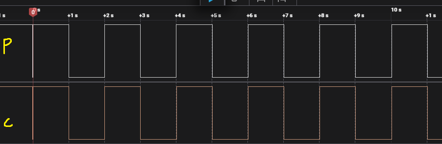
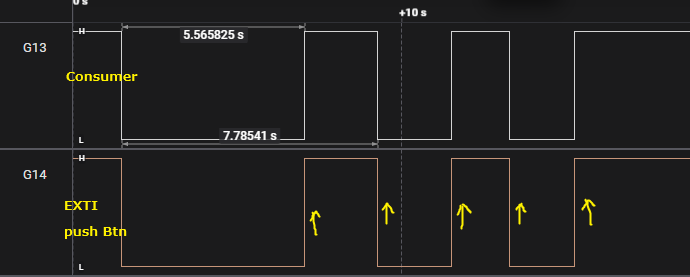
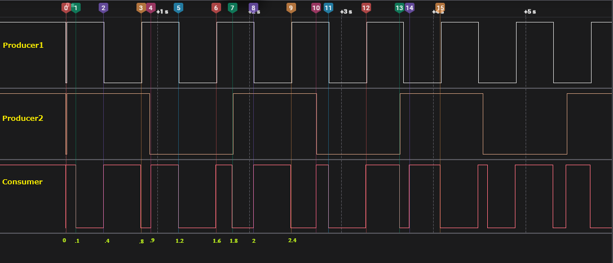

# FreeRTOS Message Buffer 

### What is Message Buffer

* A message buffer stores discrete messages (each message keeps its length).
* xMessageBufferSend() writes one message; xMessageBufferReceive() returns exactly one message (and its length).
* Good when you need to pass packets, commands or variable-length records and preserve boundaries (unlike stream buffers).
* Use xMessageBufferSendFromISR() / xMessageBufferReceiveFromISR() when in an ISR.
* API notes: check xMessageBufferSpacesAvailable() and xMessageBufferNextLengthBytes() to inspect capacity / next message size.

### Example 01: Basic Producer → Consumer (messages preserved)

* Producer sends varying-length messages ("CMD1", "HELLO MP CODING", "PAYLOAD:12345", "OK"), every 1000 ms.
* Consumer blocks on xMessageBufferReceive() and prints message content.
* PG13 toggles on send, PG11 toggles on receive.

```c

#include "FreeRTOS.h"
#include "task.h"
#include "message_buffer.h"

#include "string.h"
#include "stdio.h"

/* *********************** Create Message buffer handler ********************* */
MessageBufferHandle_t MessageBuffer_Handle;

/* *********************** Create Task Handles ******************************* */
TaskHandle_t Producer_Handle;
TaskHandle_t Consumer_Handle;

/* *********************** Task Functions ********************************** */
void Producer(void* pv)
{
	const char* msgs[] = {"CMD1", "HELLO MP CODING", "PAYLAOD:12345", "OK" };
	int i = 0;

	for(;;)
	{
		size_t len = strlen(msgs[i]);
		if (xMessageBufferSend(MessageBuffer_Handle, (void* )msgs[i], len, pdMS_TO_TICKS(100)) != len) {
			// Error
			HAL_UART_Transmit(&huart1, (uint8_t *)"Message Buffer Send Failed\r\n", 21, HAL_MAX_DELAY);
		}else {

			HAL_GPIO_TogglePin(GPIOG, GPIO_PIN_13);

			char* msg = (char*) pvPortMalloc(100 * sizeof(char)); // Allocate memory from the heap
			sprintf(msg, "Message Sent: %s\n", msgs[i]);
			HAL_UART_Transmit(&huart1, (uint8_t *)msg, strlen(msg), HAL_MAX_DELAY);
			vPortFree(msg); // Free the allocated memory
		}

		i = (i+1) % (sizeof(msgs)/sizeof(msgs[0]));

		vTaskDelay(pdMS_TO_TICKS(1000));
	}
}

void Consumer(void* pv)
{
	uint8_t rxBuffer[100];
	for (;;)
	{
		size_t received = xMessageBufferReceive(MessageBuffer_Handle, (void* )rxBuffer, sizeof(rxBuffer), portMAX_DELAY);

		HAL_GPIO_TogglePin(GPIOG, GPIO_PIN_14);

		char* msg = (char*) pvPortMalloc(100 * sizeof(char)); // Allocate memory from the heap

		sprintf(msg, "Message Received: %.*s\n", (int)received, rxBuffer);

		HAL_UART_Transmit(&huart1, (uint8_t *)msg, strlen(msg), HAL_MAX_DELAY);
		vPortFree(msg); // Free the allocated memory

	}
}


int main(void)
{
    // ............
    /* *********************** Create Message Buffer ************************** */
    MessageBuffer_Handle = xMessageBufferCreate(256); // 256 bytes buffer (Total buffer size bytes)

    if (MessageBuffer_Handle == NULL) {
    // Error
    HAL_UART_Transmit(&huart1, (uint8_t*) "Message Buffer Creation Failed\n", 31, HAL_MAX_DELAY);
    }
    else{
    HAL_UART_Transmit(&huart1, (uint8_t*) "Message Buffer Created Successfully\n", 37, HAL_MAX_DELAY);
    }

    /* *********************** Create Tasks ********************************** */
    xTaskCreate(Producer, "Producer", 256, NULL, 2, &Producer_Handle);
    xTaskCreate(Consumer, "Consumer", 256, NULL, 1, &Consumer_Handle);

    /* *********************** Start Scheduler ******************************* */
    vTaskStartScheduler();

}

```

```
Message Buffer Created Successfully
Message Sent: CMD1
Message Received: CMD1
Message Sent: HELLO MP CODING
Message Received: HELLO MP CODING
Message Sent: PAYLAOD:12345
Message Received: PAYLAOD:12345
Message Sent: OK
Message Received: OK
Message Sent: CMD1
Message Received: CMD1
Message Sent: HELLO MP CODING
Message Received: HELLO MP CODING
Message Sent: PAYLAOD:12345
Message Received: PAYLAOD:12345
Message Sent: OK
Message Received: OK
Message Sent: CMD1
Message Received: CMD1
Message Sent: HELLO MP CODING
Message Received: HELLO MP CODING
Message Sent: PAYLAOD:12345
Message Received: PAYLAOD:12345
Message Sent: OK
Message Received: OK
```

### Example 02  ISR injects urgent message (ISR → consumer)

Main producers run as before. User presses PA0 — EXTI ISR calls xMessageBufferSendFromISR() to enqueue an urgent message (e.g. "ALERT"). Consumer will receive that message in order.

```c
/* ***************************** Create Message Buffer handle *********************** */
MessageBufferHandle_t MessageBuffer_Handle;

/* ***************************** Task Handles *************************** */
TaskHandle_t Consumer_Handle;

/* ***************************** Task Functions *************************** */
void Consumer(void *pvParameters)
{
	uint8_t rx[100];
	for(;;) {
		size_t received = xMessageBufferReceive(MessageBuffer_Handle, rx, sizeof(rx), portMAX_DELAY);
		HAL_GPIO_TogglePin(GPIOG, GPIO_PIN_13); // consume marker

		char* msg = (char*)pvPortMalloc(100 * sizeof(char));
		sprintf(msg, "Consumer recv %.*s\n", (int)received, rx);
		HAL_UART_Transmit(&huart1, (uint8_t *)msg, strlen(msg), HAL_MAX_DELAY);
		vPortFree(msg); // Free the allocated memory
  }
}

void HAL_GPIO_EXTI_Callback(uint16_t GPIO_Pin)
{
	if (GPIO_Pin == GPIO_PIN_0)
	{
		const char alert[] = "ALERT";
		BaseType_t xHigherPriorityTaskWoken = pdFALSE;

		xMessageBufferSendFromISR(MessageBuffer_Handle, (void *)alert, sizeof(alert), &xHigherPriorityTaskWoken);

		HAL_GPIO_TogglePin(GPIOG, GPIO_PIN_14);

		portYIELD_FROM_ISR(xHigherPriorityTaskWoken);
	}
}
```



```
Message Buffer Created
Consumer recv ALERT
Consumer recv ALERT
Consumer recv ALERT
Consumer recv ALERT
Consumer recv ALERT
```


### Example M3 — Multiple Producers (variable sizes) + overflow behavior

```c
/* *************************** Message Buffer Handle *********************** */
MessageBufferHandle_t MessageBuffer_Handle;

/* *************************** Tasks Handles ****************************** */
TaskHandle_t Producer01_Handle;
TaskHandle_t Producer02_Handle;

TaskHandle_t Consumer_Handle;

/* *************************** Task Functions ******************************* */
void Producer01(void* pv)
{
	uint8_t msg[8];
	memset(msg, 'a', sizeof(msg));

	for(;;)
	{
		if(xMessageBufferSend(MessageBuffer_Handle, msg, sizeof(msg), pdMS_TO_TICKS(100)) != pdPASS)
		{
			HAL_UART_Transmit(&huart1, (uint8_t*)"P1 Message Send Failed\n", 24, HAL_MAX_DELAY);
			HAL_GPIO_TogglePin(GPIOG, GPIO_PIN_13);
		}

		vTaskDelay(pdMS_TO_TICKS(400));
	}
}

void Producer02(void* pv)
{
	uint8_t msg[24];
	memset(msg, 'B', sizeof(msg));

	for(;;)
	{
		if(xMessageBufferSend(MessageBuffer_Handle, msg, sizeof(msg), pdMS_TO_TICKS(100)) != pdPASS)
		{
			HAL_UART_Transmit(&huart1, (uint8_t*) "P2 Message Send Failed\n", 24, HAL_MAX_DELAY);
			HAL_GPIO_TogglePin(GPIOG, GPIO_PIN_14);
		}

		vTaskDelay(pdMS_TO_TICKS(900));
	}
}

void Consumer(void* pv)
{
	uint8_t rxBuffer[64];
	size_t receivedBytes;
	size_t freeSpaceBytes;

	for(;;)
	{
		// Block until a message arrives
		receivedBytes = xMessageBufferReceive(MessageBuffer_Handle, rxBuffer, sizeof(rxBuffer), portMAX_DELAY);

		HAL_GPIO_TogglePin(GPIOG, GPIO_PIN_11);

		// Print received message
		char log[80];
		sprintf(log,"Consumer: Received msg (len=%u): %.*s\n",(unsigned)receivedBytes ,(unsigned)receivedBytes, rxBuffer);
		HAL_UART_Transmit(&huart1, (uint8_t*)log, strlen(log), HAL_MAX_DELAY);

		// Show buffer usage
		freeSpaceBytes = xMessageBufferSpacesAvailable(MessageBuffer_Handle);
		sprintf(log,"Consumer: Free space = %u bytes\n", (unsigned)freeSpaceBytes);
		HAL_UART_Transmit(&huart1, (uint8_t*)log, strlen(log), HAL_MAX_DELAY);

		vTaskDelay(pdMS_TO_TICKS(100));  //
	}
}

int main(void)
{
	// ...

	/* ************************* Create Message Buffer ****************************** */
	MessageBuffer_Handle = xMessageBufferCreate(256);
	if (MessageBuffer_Handle == NULL) {
		HAL_UART_Transmit(&huart1, (uint8_t*)"Message Buffer Creation Failed\n", 32, HAL_MAX_DELAY);
	}else{
		HAL_UART_Transmit(&huart1, (uint8_t*)"Message Buffer Created Successfully\n", 36, HAL_MAX_DELAY);
	}

	/* ************************** Create Tasks ********************************** */
	xTaskCreate(Producer01, "Producer01", 256, NULL, 1, &Producer01_Handle);
	xTaskCreate(Producer02, "Producer02", 256, NULL, 1, &Producer02_Handle);

	xTaskCreate(Consumer, "Consumer", 256, NULL, 2, &Consumer_Handle);

	/* ************************** Start Scheduler ********************************** */
	vTaskStartScheduler();
}

```



|		log											|
|---------------------------------------------------|
Message Buffer Created Successfully
Consumer: Received msg (len=8): aaaaaaaa 
Consumer: Free space = 256 bytes
P2 Message Send Failed
Consumer: Received msg (len=16): BBBBBBBBBBBBBBBB 
Consumer: Free space = 256 bytes
Consumer: Received msg (len=8): aaaaaaaa
Consumer: Free space = 256 bytes
P1 Message Send Failed
Consumer: Received msg (len=8): aaaaaaaa
Consumer: Free space = 256 bytes
P1 Message Send Failed
P2 Message Send Failed
Consumer: Received msg (len=16): BBBBBBBBBBBBBBBB
Consumer: Free space = 256 bytes
Consumer: Received msg (len=8): aaaaaaaa
Consumer: Free space = 256 bytes
P1 Message Send Failed
Consumer: Received msg (len=8): aaaaaaaa
Consumer: Free space = 256 bytes
P1 Message Send Failed
Consumer: Received msg (len=16): BBBBBBBBBBBBBBBB
Consumer: Free space = 256 bytes
P2 Message Send Failed
Consumer: Received msg (len=8): aaaaaaaa
Consumer: Free space = 256 bytes
P1 Message Send Failed
Consumer: Received msg (len=8): aaaaaaaa
Consumer: Free space = 256 bytes
P1 Message Send Failed
Consumer: Received msg (len=16): BBBBBBBBBBBBBBBB
Consumer: Free space = 256 bytes
P2 Message Send Failed
