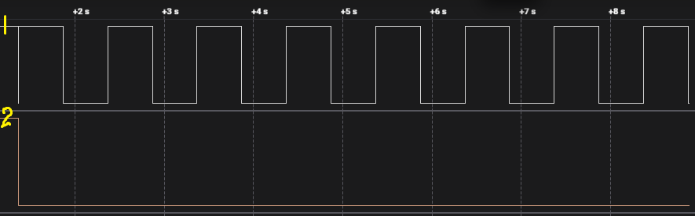
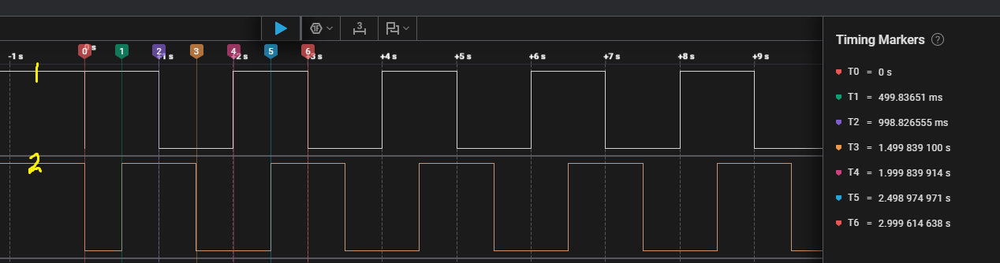
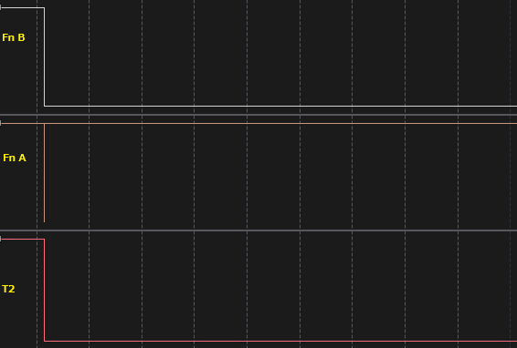
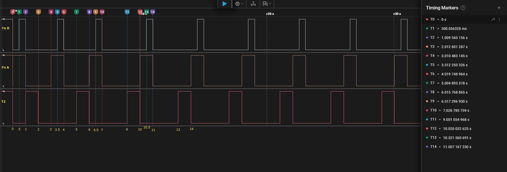

[](https://www.youtube.com/watch?v=DO_xbIu7GK0) 

# Normal Mutex

* A mutex (mutual exclusion) is used to protect a shared resource (like UART, I²C, SPI, or a buffer).
* A task can take the mutex if it’s available, use the resource, and then give it back.
* If the same task tries to take the mutex again before releasing it, it will block — because the mutex is already owned, even though by itself.
	* → This can lead to self-deadlock.

## Example 01:

```c
/* ************************* Mutex Handle ************************* */
SemaphoreHandle_t Mutex_Handle;

/* ************************* Task Handles *********************************** */
TaskHandle_t Mutex_Handle, Task02_Handle;

/* ************************* Task Functions ************************** */
void Task01(void *pvParameters);
void Task02(void *pvParameters);

void GPIO_TOGLE_01()
{
	xSemaphoreTake(Mutex_Handle, portMAX_DELAY); // acquire the mutex

	HAL_GPIO_TogglePin(GPIOG, GPIO_PIN_13);
	vTaskDelay(pdMS_TO_TICKS(500));

	xSemaphoreGive(Mutex_Handle); // release the mutex
}

void GPIO_TOGLE_02()
{
	xSemaphoreTake(Mutex_Handle, portMAX_DELAY); // acquire the mutex

	HAL_GPIO_TogglePin(GPIOG, GPIO_PIN_14);
	vTaskDelay(pdMS_TO_TICKS(500));

	xSemaphoreGive(Mutex_Handle); // release the mutex
}

int main(void)
{
    // .......

  Mutex_Handle = xSemaphoreCreateMutex();
  if (Mutex_Handle == NULL) {
		HAL_UART_Transmit(&huart1, (uint8_t *)"Mutex Creation Failed\r\n", 23, HAL_MAX_DELAY);
   }

   xTaskCreate(Task01, "T1", 128, NULL, 2, &Task01_Handle);
   xTaskCreate(Task02, "T2", 128, NULL, 1, &Task02_Handle);


   vTaskStartScheduler();

    // .......
}

void Task01(void* argument){
	while(1){
		GPIO_TOGLE_01();
	}
}

void Task02(void *argument) {
	while(1){
		GPIO_TOGLE_02();
	}
}

```



* `Task02` Waits forever. High-priority `Task01` takes the mutex first.

## Example 02
```c
void GPIO_TOGLE_01()
{
	xSemaphoreTake(SimpleMutex, portMAX_DELAY); // acquire the mutex

	HAL_GPIO_TogglePin(GPIOG, GPIO_PIN_13);
	vTaskDelay(pdMS_TO_TICKS(500));

	xSemaphoreGive(SimpleMutex); // release the mutex
}

void GPIO_TOGLE_02()
{
	xSemaphoreTake(SimpleMutex, portMAX_DELAY); // acquire the mutex

	HAL_GPIO_TogglePin(GPIOG, GPIO_PIN_14);
	vTaskDelay(pdMS_TO_TICKS(500));

	xSemaphoreGive(SimpleMutex); // release the mutex
}

int main(void)
{
    // .......

  SimpleMutex = xSemaphoreCreateMutex();
  if (SimpleMutex == NULL) {
		HAL_UART_Transmit(&huart1, (uint8_t *)"Mutex Creation Failed\r\n", 23, HAL_MAX_DELAY);
   }

   xTaskCreate(Task01, "Task01", 128, NULL, 2, &Task01_Handle);
   xTaskCreate(Task02, "Task02", 128, NULL, 1, &Task02_Handle);


   vTaskStartScheduler();

    // .......
}

void Task01(void* argument){
	while(1){
		GPIO_TOGLE_01();
        vTaskDelay(pdMS_TO_TICKS(500)); // Add a delay to allow Task02 to run
	}
}

void Task02(void *argument) {
	while(1){
		GPIO_TOGLE_02();
	}
}
```



* After `Task01` (high-priority) releases the mutex, it goes into a waiting state for **500 ms** .
* During this time, the lower-priority `Task02` is able to take the mutex and start running.
* While `Task02` is holding the mutex, `Task01` wakes up and tries to take it again. Since the mutex is still locked by Task02, `Task01` has to block until the mutex is released.
* To prevent **priority inversion**, RTOS applies **priority inheritance**: `Task02` temporarily inherits the priority of `Task01` (the higher-priority task), so that it can finish quickly and release the mutex. Once released, `Task01` regains the mutex and runs, while `Task02` drops back to its original priority.

## Example 03 : (Check Ownership)

```c
/* ************************* Task Functions ************************** */
void Task01(void *pvParameters)
{
	while(1)
	{
		xSemaphoreTake(Mutex_Handle, portMAX_DELAY); // acquire the mutex

		HAL_GPIO_TogglePin(GPIOG, GPIO_PIN_13);
		vTaskDelay(pdMS_TO_TICKS(500));

		HAL_GPIO_TogglePin(GPIOG, GPIO_PIN_13);
		//xSemaphoreGive(Mutex_Handle); // not release the mutex
		//vTaskDelay(pdMS_TO_TICKS(10)); // small delay to allow Task02 to run
	}
}

void Task02(void *pvParameters)
{
	while(1)
	{
		xSemaphoreTake(Mutex_Handle, portMAX_DELAY); // acquire the mutex

		HAL_GPIO_TogglePin(GPIOG, GPIO_PIN_14);
		vTaskDelay(pdMS_TO_TICKS(500));

		HAL_GPIO_TogglePin(GPIOG, GPIO_PIN_14);
		//xSemaphoreGive(Mutex_Handle); // not release the mutex
	}
}


void HAL_GPIO_EXTI_Callback(uint16_t GPIO_Pin)
{
	if(GPIO_Pin == GPIO_PIN_0)
	{
		HAL_GPIO_TogglePin(GPIOG, GPIO_PIN_11); // Toggle (PG11) to indicate button press
		// Try to release Mutex, when the button is pressed
		BaseType_t xHigherPriorityTaskWoken = pdFALSE;
		xSemaphoreGiveFromISR(Mutex_Handle, &xHigherPriorityTaskWoken);

		// Request a context switch if a higher priority task was woken
		portEND_SWITCHING_ISR(xHigherPriorityTaskWoken);
	}
}

```
**The above ISR release will not work, and it's completely wrong. Can't release the mutex outside the owner.**
* ISR can’t release a mutex (because of ownership).
* The mutex stays locked.
* Tasks remain blocked.
* Interrupt never fully clears, so it triggers only once.

<br></br>


# Recursive Mutex

* The Normal Mutex `same task tries to take the mutex again before releasing it, it will block — because the mutex is already owned, even though by itself.`
* A recursive mutex solves that. If a task already owns the mutex and tries to take it again, it will succeed (the “lock count” increases).
* The task must then give the mutex the same number of times it took it.
	* A Recursive Mutex keeps track of two things:
		1. Which task currently owns it (the **“owner”**).
		2. How many times that owner has locked it (**lock count**).
	* Only the owner task can **“re-take”** the same mutex multiple times. Each `xSemaphoreTakeRecursive()` increments the lock count, and each `xSemaphoreGiveRecursive()` decrements it.
	* The mutex is only considered free (available for other tasks) when the lock count reaches zero.
	* If a different task tries to take the mutex while it is owned (no matter what the lock count is), it will block (or fail if a timeout is used) — because recursive locking applies only to the owner task.
* **Only when the lock count returns to zero is the mutex actually released, making it available for other tasks.**

### Why do we need it?
Recursive mutexes are useful when:

1. A function that locks a resource may call another function that also locks the same resource.
	* Example:
		* LogMessage() locks the UART mutex.
		* Inside LogMessage(), it calls FormatMessage() which also tries to lock the same UART mutex.
		* Without a recursive mutex, the task deadlocks on itself.
		* With a recursive mutex, it’s safe.

2. Library functions: Sometimes you don’t control all code paths — a library might use the same mutex internally, and your task that already holds it may call into the library.

### 🛠️ Case 1: Normal Mutex (Deadlock Example)

```c
/* ************************* Mutex Handle ************************* */
QueueHandle_t MutexHandle;

/* ************************* Task Handles ************************* */
TaskHandle_t Task01_Handle, Task02_Handle;


/* ************************ Some functions ************************ */
void Function_B()
{
	// Try to lock the mutex again inside Function_B
	if(xSemaphoreTake(MutexHandle, portMAX_DELAY) == pdPASS) // This will not work this is normal Mutex
	{
		HAL_GPIO_TogglePin(GPIOG, GPIO_PIN_13); // indicate Function_B
		HAL_UART_Transmit(&huart1, (uint8_t*)"Task01: Enter Function_B\n", 26, HAL_MAX_DELAY);

		vTaskDelay(pdMS_TO_TICKS(500));

		HAL_UART_Transmit(&huart1, (uint8_t*)"Task01: Exit Function_B Releasing Mutex\n", 42, HAL_MAX_DELAY);
		HAL_GPIO_TogglePin(GPIOG, GPIO_PIN_13);

		// Release mutex 
		xSemaphoreGive(MutexHandle);
	}
}

void Function_A()
{
	// First lock in Function_A
	if(xSemaphoreTake(MutexHandle, portMAX_DELAY) == pdPASS) // Take the mutex
	{
		HAL_GPIO_TogglePin(GPIOG, GPIO_PIN_14); // indicate Function_A
		HAL_UART_Transmit(&huart1, (uint8_t*)"Task01: Enter Function_A\n", 26, HAL_MAX_DELAY);

		vTaskDelay(pdMS_TO_TICKS(500));

		// Call nested function that also uses the same mutex
		Function_B();

		HAL_UART_Transmit(&huart1, (uint8_t*)"Task01: Exit Function_A Releasing Mutex\n", 42, HAL_MAX_DELAY);
		HAL_GPIO_TogglePin(GPIOG, GPIO_PIN_14);

		// Release mutex once for Function_A
		xSemaphoreGive(MutexHandle);
	}
}

/* ************************* Task Functions *********************** */
void Task01(void *pvParameters)
{
	for(;;)
	{
		Function_A(); // Top-level call
		vTaskDelay(pdMS_TO_TICKS(2000)); // Run every 2s
	}
}

void Task02(void *pvParameters)
{
	for(;;)
	{
		// Task02 also wants to use the same resource
		if (xSemaphoreTake(MutexHandle, portMAX_DELAY) == pdPASS) {
			HAL_GPIO_TogglePin(GPIOG, GPIO_PIN_11); // indicate Task02
			HAL_UART_Transmit(&huart1, (uint8_t*) "Task02: Acquired Mutex\n", 23, HAL_MAX_DELAY);

			vTaskDelay(pdMS_TO_TICKS(1000));

			HAL_UART_Transmit(&huart1, (uint8_t*) "Task02: Releasing Mutex\n", 25, HAL_MAX_DELAY);
			HAL_GPIO_TogglePin(GPIOG, GPIO_PIN_11);

			xSemaphoreGive(MutexHandle);
		}

		vTaskDelay(pdMS_TO_TICKS(3000)); // Run every 3s
	}
}

int main(void)
{
	// ....

  /* ************************ Create Tasks ************************** */
  MutexHandle = xSemaphoreCreateMutex();
  if (MutexHandle == NULL) {
	HAL_UART_Transmit(&huart1, (uint8_t *)"Mutex creation failed\n", 23, HAL_MAX_DELAY);
  }else{
	HAL_UART_Transmit(&huart1, (uint8_t *)"Mutex created\n", 16, HAL_MAX_DELAY);
  }

  xTaskCreate(Task01, "T1", 256, NULL, 2, &Task01_Handle);
  xTaskCreate(Task02, "T2", 256, NULL, 1, &Task02_Handle);

  vTaskStartScheduler();

}

```


```
Mutex created
Task01: Enter Function_A
(Task stuck here forever)
```
Flow:
1. `Task01` starts and takes the normal mutex to protect UART.
2. Inside Task01, calls `Function_A()`, it calls `Function_B()`.
3. `FunctionB()` also tries to take the same normal mutex.
	* ⚠️ `Task01` blocks on itself (self-deadlock).
	* GPIO_PIN_14  for Task01 freezes ON.
4. Meanwhile, `Task02` never gets CPU because `Task01` is stuck.

### 🛠️ Case 2: Recursive Mutex (Correct Behavior)

```c
/* ************************* Mutex Handle ************************* */
QueueHandle_t RecursiveMutexHandle;

/* ************************* Task Handles ************************* */
TaskHandle_t Task01_Handle, Task02_Handle;


/* ************************ Some functions ************************ */
void Function_B()
{
	// Try to lock the mutex again inside Function_B
	if(xSemaphoreTakeRecursive(RecursiveMutexHandle, portMAX_DELAY) == pdPASS) // This will succeed since it's a recursive mutex, incrementing the lock count
	{
		HAL_GPIO_TogglePin(GPIOG, GPIO_PIN_13); // indicate Function_B
		HAL_UART_Transmit(&huart1, (uint8_t*)"Task01: Enter Function_B\n", 26, HAL_MAX_DELAY);

		vTaskDelay(pdMS_TO_TICKS(500));

		HAL_UART_Transmit(&huart1, (uint8_t*)"Task01: Exit Function_B Releasing Mutex\n", 42, HAL_MAX_DELAY);
		HAL_GPIO_TogglePin(GPIOG, GPIO_PIN_13);

		// Release mutex (decrement lock count)
		xSemaphoreGiveRecursive(RecursiveMutexHandle);
	}
}

void Function_A()
{
	// First lock in Function_A
	if(xSemaphoreTakeRecursive(RecursiveMutexHandle, portMAX_DELAY) == pdPASS) //
	{
		HAL_GPIO_TogglePin(GPIOG, GPIO_PIN_14); // indicate Function_A
		HAL_UART_Transmit(&huart1, (uint8_t*)"Task01: Enter Function_A\n", 26, HAL_MAX_DELAY);

		vTaskDelay(pdMS_TO_TICKS(500));

		// Call nested function that also uses the same mutex
		Function_B();

		HAL_UART_Transmit(&huart1, (uint8_t*)"Task01: Exit Function_A Releasing Mutex\n", 42, HAL_MAX_DELAY);
		HAL_GPIO_TogglePin(GPIOG, GPIO_PIN_14);

		// Release mutex once for Function_A
		xSemaphoreGiveRecursive(RecursiveMutexHandle);
	}
}

/* ************************* Task Functions *********************** */
void Task01(void *pvParameters)
{
	for(;;)
	{
		Function_A(); // Top-level call
		vTaskDelay(pdMS_TO_TICKS(2000)); // Run every 2s
	}
}

void Task02(void *pvParameters)
{
	for(;;)
	{
		// Task02 also wants to use the same resource
		if (xSemaphoreTakeRecursive(RecursiveMutexHandle, portMAX_DELAY) == pdPASS) {
			HAL_GPIO_TogglePin(GPIOG, GPIO_PIN_11); // indicate Task02
			HAL_UART_Transmit(&huart1, (uint8_t*) "Task02: Acquired Mutex\n", 23, HAL_MAX_DELAY);

			vTaskDelay(pdMS_TO_TICKS(1000));

			HAL_UART_Transmit(&huart1, (uint8_t*) "Task02: Releasing Mutex\n", 25, HAL_MAX_DELAY);
			HAL_GPIO_TogglePin(GPIOG, GPIO_PIN_11);

			xSemaphoreGiveRecursive(RecursiveMutexHandle);
		}

		vTaskDelay(pdMS_TO_TICKS(3000)); // Run every 3s
	}
}

int main(void)
{
	// ....

  /* ************************ Create Tasks ************************** */
  RecursiveMutexHandle = xSemaphoreCreateRecursiveMutex();
  if (RecursiveMutexHandle == NULL) {
	HAL_UART_Transmit(&huart1, (uint8_t *)"Mutex creation failed\n", 23, HAL_MAX_DELAY);
  }else{
	HAL_UART_Transmit(&huart1, (uint8_t *)"Mutex created\n", 16, HAL_MAX_DELAY);
  }

  xTaskCreate(Task01, "T1", 256, NULL, 2, &Task01_Handle);
  xTaskCreate(Task02, "T2", 256, NULL, 1, &Task02_Handle);

  vTaskStartScheduler();

}

```



log 										| Time 	| Comments | 
----------------------------------------	| ------|----------| 
Mutex created								| 0.0s	| created Recursive Mutex
Task01: Enter Function_A 					| 0.0s	| Enter to `Task01` and Calls `Fn_A` (**Fn_A** : Take Recursive Mutex and lock)
Task01: Enter Function_B					| 0.5s	| `Fn_A` waits **0.5s** & calls `Fn_B` (**Fn_B** : Take Recursive Mutex and increase the lock count)
Task01: Exit Function_B Releasing Mutex		| 1.0s	| `Fn_B` waits **0.5s** & Exit. (Release mutex: decrement lock count)
Task01: Exit Function_A Releasing Mutex		| 1.0s	| `Fn_A` Release the mutex & exit `Fn_A`. (then `Task01` waits **2s**)
Task02: Acquired Mutex						| 1.0s	| `Task02` Acquired Mutex and waits **1s**
Task02: Releasing Mutex						| 2.0s	| `Task02` Releasing Mutex & `Task02` waits **3s**
Task01: Enter Function_A					| 3.0s	| After waiting **2s**, `Task01` tries again to take the mutex. By this time, `Task02` has already released the mutex, so `Task01` successfully takes ownership. If `Task01` had attempted to take the mutex before `Task02` released it, `Task01` would have been blocked until the mutex became available. Even though this is a Recursive Mutex, the rule of ownership still applies — only the task that already owns the mutex can take it multiple times (incrementing the lock count). Other tasks must wait until the mutex is completely released (lock count = 0).
Task01: Enter Function_B					| 3.5s  | 
Task01: Exit Function_B Releasing Mutex		| 4.0s
Task01: Exit Function_A Releasing Mutex		| 4.0s
Task02: Acquired Mutex						| 5.0s
Task02: Releasing Mutex						| 6.0s
Task01: Enter Function_A					| 6.0s
Task01: Enter Function_B					| 6.5s
Task01: Exit Function_B Releasing Mutex		| 7.0s	
Task01: Exit Function_A Releasing Mutex		| 7.0s
Task02: Acquired Mutex						| 9.0s
Task02: Releasing Mutex						| 10.0s
Task01: Enter Function_A					| 10.0s
Task01: Enter Function_B					| 10.5s
Task01: Exit Function_B Releasing Mutex		| 11.0s
Task01: Exit Function_A Releasing Mutex		| 11.0s


Flow:
1. `Task01` starts and takes the **recursive mutex**.
2. Inside `Function_A()`, it calls `Function_B()`.
3. `Function_B()` also takes the same recursive mutex.
	* ✅ Allowed — lock count increases.
4. `Task01` prints via UART, toggles GPIO, then exits `Function_B()` and `Function_A()`.
	* Each level calls xSemaphoreGiveRecursive() → lock count returns to zero → mutex released.
5. `Task02` can now take the mutex and run normally.


