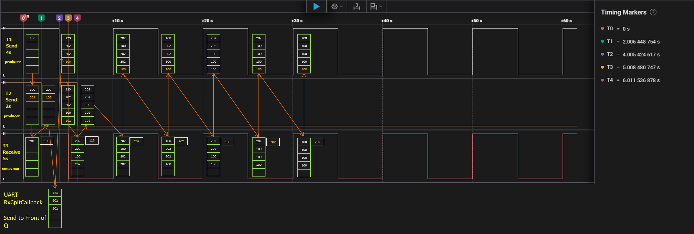

# RTOS QUEUE

### Simple integer Queue
**FreeRTOS** integer queue safely passes data from a `producer` to a `consumer`.

```c

uint8_t rx_data = 0;

/* ******************* TASK HANDLERS ******************* */
xTaskHandle Task01_Handle;
xTaskHandle Task02_Handle;
xTaskHandle Task03_Handle;

/* ******************* QUEUE HANDLER ******************* */
xQueueHandle Queue_Handle;

/* ******************* TASK FUNCTIONS ******************* */
void Task01_Producer(void* argument)
{
	int t1Value = 100;
	uint32_t TickDelay = pdMS_TO_TICKS(4000); // convert ms to ticks
	while(1){

		char* str = (char*) pvPortMalloc(100 * sizeof(char)); // Allocate memory from the heap

		if(xQueueSend(Queue_Handle, &t1Value, portMAX_DELAY) == pdPASS){

			HAL_GPIO_TogglePin(GPIOG, GPIO_PIN_13);

			sprintf(str, "T1 Successfully sent count to the queue: %d\n", t1Value);
			HAL_UART_Transmit(&huart1, (uint8_t *)str, strlen(str), HAL_MAX_DELAY);

		}

		vPortFree(str); // Free the allocated memory

		vTaskDelay(TickDelay);
	}
}

void Task02_Producer(void* argument)
{
	int t2Value = 202;
	uint32_t TickDelay = pdMS_TO_TICKS(2000); // convert ms to ticks
	while(1){

		char* str = (char*) pvPortMalloc(100 * sizeof(char)); // Allocate memory from the heap

		if(xQueueSend(Queue_Handle, &t2Value, portMAX_DELAY) == pdPASS){

			HAL_GPIO_TogglePin(GPIOG, GPIO_PIN_14);

			sprintf(str, "T2 Successfully sent count to the queue: %d\n", t2Value);
			HAL_UART_Transmit(&huart1, (uint8_t *)str, strlen(str), HAL_MAX_DELAY);

		}

		vPortFree(str); // Free the allocated memory

		vTaskDelay(TickDelay);
	}
}

void Task03_Consumer(void* argument)
{
	int received = 0;
	uint32_t TickDelay = pdMS_TO_TICKS(5000); // convert ms to ticks
	while(1){

		char* str = (char*) pvPortMalloc(100 * sizeof(char)); // Allocate memory from the heap

		if(xQueueReceive(Queue_Handle, &received, portMAX_DELAY) != pdTRUE) // Wait indefinitely until something arrives
		{
			HAL_UART_Transmit(&huart1, (uint8_t*) "Error in receiving from Queue\n", 31, HAL_MAX_DELAY);
		}else {

			HAL_GPIO_TogglePin(GPIOG, GPIO_PIN_11);

			sprintf(str, "Successfully received value from the queue: %d  \n\n", received);
			HAL_UART_Transmit(&huart1, (uint8_t *)str, strlen(str), HAL_MAX_DELAY);
		}

		vPortFree(str); // Free the allocated memory

		vTaskDelay(TickDelay);
	}
}

void HAL_UART_RxCpltCallback(UART_HandleTypeDef* huart)
{

	int ToSend = 123;
	if(rx_data == 'r')
	{
		BaseType_t xHigherPriorityTaskWoken = pdFALSE;

		if (xQueueSendToFrontFromISR(Queue_Handle, &ToSend, &xHigherPriorityTaskWoken) == pdPASS) // if queue is full, it will block.
		{
			HAL_UART_Transmit(huart, (uint8_t*) "\nSent from ISR\n\n", 17, HAL_MAX_DELAY);
		}else {
			HAL_UART_Transmit(huart, (uint8_t*) "\nCould not send from ISR Queue Full\n\n", 38, HAL_MAX_DELAY); // queue full
		}

		portEND_SWITCHING_ISR(xHigherPriorityTaskWoken);
	}

    // Restart UART Reception in Interrupt mode
	HAL_UART_Receive_IT(huart, &rx_data, 1);
}

int main(void)
{
    // ...

  /* ********************* Create integer QUEUE ********************* */
  Queue_Handle = xQueueCreate(5, sizeof(int));
  if (Queue_Handle == NULL) {
	// Queue was not created and must not be used.
	HAL_UART_Transmit(&huart1, (uint8_t *)"Queue was not created and must not be used.\n", 43, HAL_MAX_DELAY);
  }else{
	HAL_UART_Transmit(&huart1, (uint8_t*) "Queue created successfully.\n", 30, HAL_MAX_DELAY);
  }

  /* ********************* Create Tasks ********************* */
  xTaskCreate(Task01_Producer, "T1", 128, NULL, 3, &Task01_Handle);
  xTaskCreate(Task02_Producer, "T2", 128, NULL, 2, &Task02_Handle);
  xTaskCreate(Task03_Consumer, "T3", 128, NULL, 1, &Task03_Handle);

  /* Start UART Reception in Interrupt mode */
  HAL_UART_Receive_IT(&huart1, &rx_data, 1);

  vTaskStartScheduler(); // This function will never return unless RTOS scheduler stops

    // ...
}

```



 
### UART Output
__________________________________________________________________________________
Queue created successfully.     
T1 Successfully sent count to the queue: 100    
T2 Successfully sent count to the queue: 202    
`Successfully received value from the queue: 100`      

T2 Successfully sent count to the queue: 202    
r   
Sent from ISR   

T1 Successfully sent count to the queue: 100    
T2 Successfully sent count to the queue: 202    
`Successfully received value from the queue: 123`  

T2 Successfully sent count to the queue: 202    
T1 Successfully sent count to the queue: 100    
`Successfully received value from the queue: 202` 

T1 Successfully sent count to the queue: 100    
`Successfully received value from the queue: 202`   

T1 Successfully sent count to the queue: 100    
`Successfully received value from the queue: 100`   

T1 Successfully sent count to the queue: 100    
`Successfully received value from the queue: 202`   

T1 Successfully sent count to the queue: 100    
`Successfully received value from the queue: 202`  

T1 Successfully sent count to the queue: 100    
`Successfully received value from the queue: 100`  

T1 Successfully sent count to the queue: 100    
`Successfully received value from the queue: 100`   

T1 Successfully sent count to the queue: 100    
`Successfully received value from the queue: 100`   

T1 Successfully sent count to the queue: 100    
`Successfully received value from the queue: 100`   

r   
Could not send from ISR Queue Full  

T1 Successfully sent count to the queue: 100    
`Successfully received value from the queue: 100`      

T1 Successfully sent count to the queue: 100    
`Successfully received value from the queue: 100` 
___________________________________________________________________________________________
### 📝 Explanation of Output (Queue Example)

**Queue creation**
```c
Queue created successfully.
```
* Confirms that a queue of length 5 with item size sizeof(int) was created successfully.
* This queue will temporarily store integers from producer tasks (Task01, Task02) or from the ISR.

**First producer outputs**
```c
T1 Successfully sent count to the queue: 100
T2 Successfully sent count to the queue: 202
Successfully received value from the queue: 100
```
* Task01 (Producer 1) sends the value 100 → toggles GPIO13.
* Task02 (Producer 2) sends the value 202 → toggles GPIO14.
* Task03 (Consumer) dequeues the first value (100) and toggles GPIO11.

At this moment, the queue contains [202].

**Injection from ISR**
```c
T2 Successfully sent count to the queue: 202
r
Sent from ISR
```
* Task02 sends another 202.
* The user pressed r on UART → ISR triggered, and 123 was pushed to the front of the queue.
* Queue content after this: [123, 202, 202].

**Consumer starts dequeuing**
```c
T1 Successfully sent count to the queue: 100
T2 Successfully sent count to the queue: 202
Successfully received value from the queue: 123

T2 Successfully sent count to the queue: 202
```
* Task01 sends 100, Task02 sends 202.
* Consumer dequeues 123 (injected by ISR).
    ✅ Demonstrates priority effect of xQueueSendToFrontFromISR().
* Queue now has [202, 202, 100, 202, 202].

**More consumer cycles**
```c
T1 Successfully sent count to the queue: 100
Successfully received value from the queue: 202
```

* Why the output order looks "reversed"

At first glance, it looks like Task01 (producer, higher priority) was able to send 100 before Task03 (consumer, lower priority) consumed a value. But according to the code, Task01 should have been blocked because the queue was full — so the consumer must run first to free a slot.

What actually happens internally:   
1. The queue is full when `Task01` tries to send **100**. `Task01` is placed in the Blocked state (waiting for space).
2. `Task03` (consumer) immediately gets CPU time, consumes **202**, and frees a slot in the queue.
3. As soon as the slot is freed, the scheduler wakes up the highest priority task waiting on that queue → `Task01`.
4. `Task01` runs immediately and sends **100**.
5. After that, `Task03` continues and prints the log message for the value it consumed.

Because `Task01` has higher priority, the log message `T1 Successfully sent...` is printed before the log message `Successfully received...`, even though the consumer had to run first to make space.

That’s why the UART output looks reversed. If you step through with **breakpoints**, you’ll see that the consumer actually runs first, but the higher-priority sender preempts it just before the UART print.


```c
T1 Successfully sent count to the queue: 100
Successfully received value from the queue: 202

T1 Successfully sent count to the queue: 100
Successfully received value from the queue: 100

T1 Successfully sent count to the queue: 100
Successfully received value from the queue: 202

T1 Successfully sent count to the queue: 100
Successfully received value from the queue: 202
Successfully received value from the queue: 100

T1 Successfully sent count to the queue: 100
Successfully received value from the queue: 100

T1 Successfully sent count to the queue: 100
Successfully received value from the queue: 100

T1 Successfully sent count to the queue: 100
Successfully received value from the queue: 100

T1 Successfully sent count to the queue: 100
Successfully received value from the queue: 100
```
**What happens next with Task02**

* After the first few cycles, the queue tends to fill up quickly.
* `Task02` (producer, lower priority) tries to send **202**, but if the queue is already full it will block (wait indefinitely).
* Every 5 seconds, `Task03` (consumer) runs and removes one item from the queue.
* That free slot is immediately taken by `Task01` (producer, higher priority, 4s period) because the scheduler always wakes the highest-priority task waiting on that queue.
* As a result, `Task02` never gets a chance to insert its value once the system stabilizes, and it remains blocked forever.

**Queue full case**
```c
r
Could not send from ISR Queue Full
```

* User pressed `r` again, ISR attempted to insert **123**.
* At that moment, queue already had 5 items → ISR could not push data.
* This demonstrates queue capacity limits and correct handling of the “queue full” case.