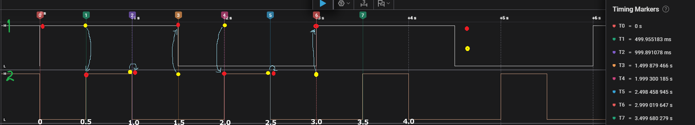
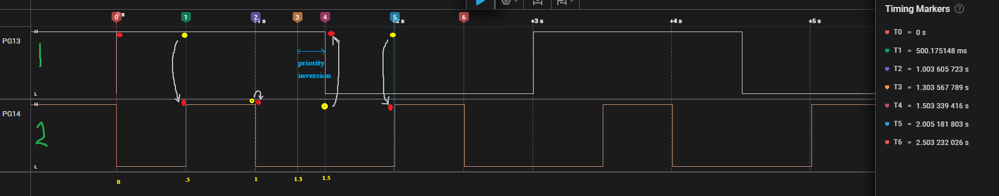
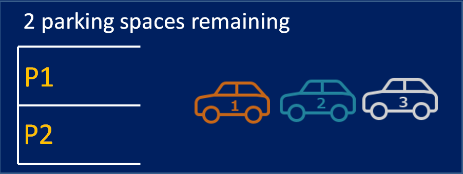
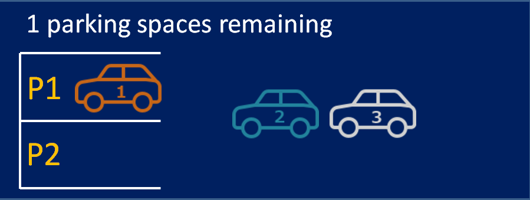
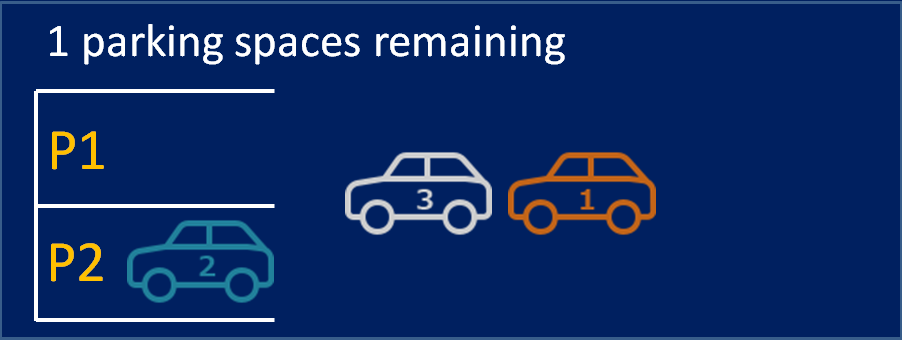
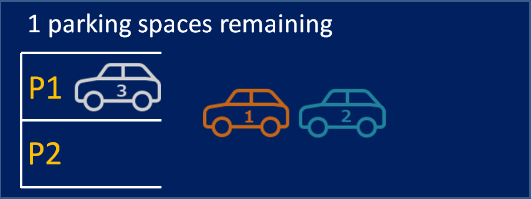
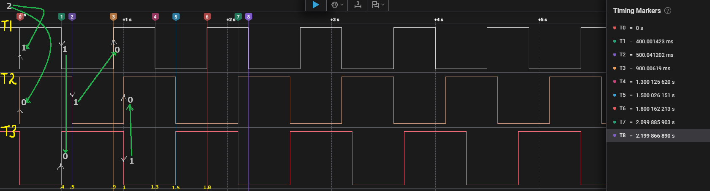
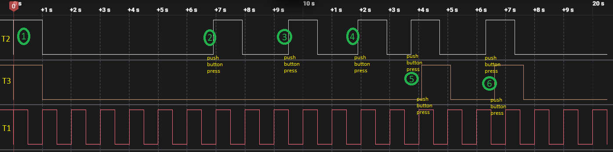

## Binary Semaphore

### Example 01 
```c
osSemaphoreId BinarySemHandle;

osThreadId task01_Handle;
osThreadId task02_Handle;

void StartTask01(void const* argument);
void StartTask02(void const* argument);

int main(void)
{
    // .....

    osSemaphoreDef(BinarySem);
    BinarySemHandle = osSemaphoreCreate(osSemaphore(BinarySem), 1);
    if (BinarySemHandle == NULL) HAL_UART_Transmit(&huart1, (uint8_t *)"BinarySemHandle creation error\r\n", 32, HAL_MAX_DELAY);
    else HAL_UART_Transmit(&huart1, (uint8_t *)"BinarySemHandle created\r\n", 26, HAL_MAX_DELAY);

    osThreadDef(Task01, StartTask01, osPriorityAboveNormal, 0, 128); // High
    task01_Handle = osThreadCreate(osThread(Task01), NULL);

    osThreadDef(Task02, StartTask01, osPriorityNormal, 0, 128); // low
    task02_Handle = osThreadCreate(osThread(Task02), NULL);

    osKernelStart();
}


void StartTask01(void const * argument)
{

  for(;;)
  {
	osSemaphoreWait(BinarySemHandle, osWaitForever);  // Wait for the semaphore to be released
	HAL_GPIO_TogglePin(GPIOG, GPIO_PIN_13);

    osDelay(500);
    osSemaphoreRelease(BinarySemHandle);  // Release the semaphore

    osDelay(1000);
  }

}

void StartTask02(void const * argument)
{

  for(;;)
  {
	  osSemaphoreWait(BinarySemHandle, osWaitForever);  // Wait for the semaphore to be released
	  HAL_GPIO_TogglePin(GPIOG, GPIO_PIN_14);

	  osDelay(500);

      osSemaphoreRelease(BinarySemHandle);  // Release the semaphore
  }

}
```


Red - Achieved  
Yellow - Released

---

### Example 02 ( Priority Inversion)
```c
void StartTask01(void const * argument)
{

  for(;;)
  {
	osSemaphoreWait(BinarySemHandle, osWaitForever);  // Wait for the semaphore to be released
	HAL_GPIO_TogglePin(GPIOG, GPIO_PIN_13);

    osDelay(500);
    osSemaphoreRelease(BinarySemHandle);  // Release the semaphore

    osDelay(800);
  }

}

void StartTask02(void const * argument)
{

  for(;;)
  {
	  osSemaphoreWait(BinarySemHandle, osWaitForever);  // Wait for the semaphore to be released
	  HAL_GPIO_TogglePin(GPIOG, GPIO_PIN_14);

	  osDelay(500);

      osSemaphoreRelease(BinarySemHandle);  // Release the semaphore
  }

}
```



### Example 03
```c
void Task01_Entry(void const * argument)
{
  /* Infinite loop */
  for(;;)
  {
	osSemaphoreWait(BinarySemHandle, osWaitForever); // Wait indefinitely for the semaphore

	HAL_GPIO_TogglePin(GPIOG, GPIO_PIN_13); // Toggle LED1 (PG13)

	HAL_UART_Transmit(&huart1, (uint8_t *)"Task 1 is running\r\n", 19, HAL_MAX_DELAY); // Transmit message over UART1

	osDelay(2000);

	HAL_UART_Transmit(&huart1, (uint8_t *)"Task 1 ended\r\n", 14, HAL_MAX_DELAY); // Transmit message over UART1

  }
}

/* USER CODE END Header_Task02_Entry */
void Task02_Entry(void const * argument)
{
  /* Infinite loop */
  for(;;)
  {
	  osSemaphoreWait(BinarySemHandle, osWaitForever); // Wait indefinitely for the semaphore

	  HAL_GPIO_TogglePin(GPIOG, GPIO_PIN_14); // Toggle LED2 (PG14)

	  HAL_UART_Transmit(&huart1, (uint8_t *)"Task 2 is running\r\n", 19, HAL_MAX_DELAY); // Transmit message over UART1

	  osDelay(3000); // Delay for 3000 ms

	  HAL_UART_Transmit(&huart1, (uint8_t *)"Task 2 ended\r\n", 14, HAL_MAX_DELAY);

  }
}

void HAL_GPIO_EXTI_Callback(uint16_t GPIO_Pin)
{
	if(GPIO_Pin == GPIO_PIN_0)
	{
		HAL_GPIO_TogglePin(GPIOG, GPIO_PIN_11); // Toggle (PG11) to indicate button press
		// Release the binary semaphore when the button is pressed
		BaseType_t xHigherPriorityTaskWoken = pdFALSE;
		xSemaphoreGiveFromISR(BinarySemHandle, &xHigherPriorityTaskWoken);

		// Request a context switch if a higher priority task was woken
		portEND_SWITCHING_ISR(xHigherPriorityTaskWoken);
	}
}
```


## Counting Semaphore

### Example 01

<ul style="list-style: none;">
<li></li>
<li></li>
<li></li>
<li></li>
<li></li>
<li></li>
</ul>

```c
void Task01(void* arguments)
{
	// Give 3 semaphores at the beginning
	xSemaphoreGive(CountingSemaphore_Handle);
	xSemaphoreGive(CountingSemaphore_Handle);

	while(1)
	{
		xSemaphoreTake(CountingSemaphore_Handle, portMAX_DELAY);
		HAL_GPIO_WritePin(GPIOG, GPIO_PIN_13, GPIO_PIN_SET);

		vTaskDelay(pdMS_TO_TICKS(400));

		HAL_GPIO_WritePin(GPIOG, GPIO_PIN_13, GPIO_PIN_RESET);
		xSemaphoreGive(CountingSemaphore_Handle);

		vTaskDelay(pdMS_TO_TICKS(500));
	}
}

void Task02(void* arguments)
{
	while(1)
	{
		xSemaphoreTake(CountingSemaphore_Handle, portMAX_DELAY);
		HAL_GPIO_WritePin(GPIOG, GPIO_PIN_14, GPIO_PIN_SET);

		vTaskDelay(pdMS_TO_TICKS(500));

		HAL_GPIO_WritePin(GPIOG, GPIO_PIN_14, GPIO_PIN_RESET);
		xSemaphoreGive(CountingSemaphore_Handle);

		vTaskDelay(pdMS_TO_TICKS(500));
	}
}

void Task03(void* arguments)
{
	while(1)
	{
		xSemaphoreTake(CountingSemaphore_Handle, portMAX_DELAY);
		HAL_GPIO_WritePin(GPIOG, GPIO_PIN_11, GPIO_PIN_SET);

		vTaskDelay(pdMS_TO_TICKS(600));

		HAL_GPIO_WritePin(GPIOG, GPIO_PIN_11, GPIO_PIN_RESET);
		xSemaphoreGive(CountingSemaphore_Handle);

		vTaskDelay(pdMS_TO_TICKS(500));
	}
}

int main(void)
{
  // ...

// Define Semaphore
  CountingSemaphore_Handle = xSemaphoreCreateCounting(2,0); // Semaphore interger value 2

// Create Tasks
  xTaskCreate(Task01, "T01", 128, NULL, 3, &Task01_Handle);
  xTaskCreate(Task02, "T02", 128, NULL, 2, &Task02_Handle);
  xTaskCreate(Task03, "T03", 128, NULL, 1, &Task03_Handle);

// Start Scheduler
  vTaskStartScheduler();


  // ....
}


```



### 🔎 What the waveform shows

- Channels (from your labels):

  - T1 (top trace) → Task01 controlling PG13.
  - T2 (middle trace) → Task02 controlling PG14.
  - T3 (bottom trace) → Task03 controlling PG11.

- Timeline Explanation:

1. At ~0.0s

   - Task01 takes a semaphore (1), sets PG13 HIGH (GPIO ON).
   - Task02 takes a semaphore (0), sets PG14 HIGH (GPIO ON).
   - No more semaphore Task3 wait(this is the blocking behavior).

2. At ~0.4s

   - Task01 release a semaphore (1), sets PG13 LOW (GPIO OFF).
   - Task03 takes a semaphore (0) , sets PG11 HIGH (GPIO ON).

3. At ~0.5s

   - Task02 release a semaphore (1), sets PG14 LOW.

4. At ~0.9s

   - Task01 takes a semaphore (0), sets PG13 HIGH (GPIO ON).

5. At ~1.0s
   - Task03 release a semaphore (1), sets PG11 LOW.
   - Task02 takes a semaphore (0), sets PG14 HIGH (GPIO ON).

### Example 02

```c
void Task01(void* arg)
{
	while(1)
	{
		HAL_GPIO_TogglePin(GPIOG, GPIO_PIN_11);
		vTaskDelay(pdMS_TO_TICKS(500));
	}
}

void Task02(void* arg)
{
	xSemaphoreGive(CountingSemaphore_Handle);
	xSemaphoreGive(CountingSemaphore_Handle);
	while(1)
	{
		xSemaphoreTake(CountingSemaphore_Handle, portMAX_DELAY);

		HAL_GPIO_WritePin(GPIOG, GPIO_PIN_13, GPIO_PIN_SET);

		vTaskDelay(pdMS_TO_TICKS(1000));

		HAL_GPIO_WritePin(GPIOG, GPIO_PIN_13, GPIO_PIN_RESET);
	}
}

void Task03(void* arg)
{
	while(1)
	{
		xSemaphoreTake(CountingSemaphore_Handle, portMAX_DELAY);

		HAL_GPIO_WritePin(GPIOG, GPIO_PIN_14, GPIO_PIN_SET);

		vTaskDelay(pdMS_TO_TICKS(1000));

		HAL_GPIO_WritePin(GPIOG, GPIO_PIN_14, GPIO_PIN_RESET);
	}
}

void HAL_GPIO_EXTI_Callback(uint16_t GPIO_Pin)
{
  if(GPIO_Pin == GPIO_PIN_0)
  {

	  // Release the binary semaphore
	  BaseType_t xHigherPriorityTaskWoken = pdFALSE;
	  xSemaphoreGiveFromISR(CountingSemaphore_Handle, &xHigherPriorityTaskWoken);

	  // Perform context switch if needed
	  portEND_SWITCHING_ISR(xHigherPriorityTaskWoken);

  }
}

int main(void)
{

  // .....

  CountingSemaphore_Handle = xSemaphoreCreateCounting(2,0);

  xTaskCreate(Task01, "T1", 128, NULL, 3, &Task01_Handle);
  xTaskCreate(Task02, "T2", 128, NULL, 2, &Task02_Handle);
  xTaskCreate(Task03, "T3", 128, NULL, 1, &Task03_Handle)

  vTaskStartScheduler();

  // ......

}

static void MX_GPIO_Init(void)
{
  // ....

  /* EXTI interrupt init*/
  HAL_NVIC_SetPriority(EXTI0_IRQn, 7, 0);
  HAL_NVIC_EnableIRQ(EXTI0_IRQn);

}
```



### ⚙️ System Setup

- Counting Semaphore created with max count = 2, initial count = 0.
- Tasks:
  - Task01 → Toggles PG11 periodically.
  - Task02 → Waits on semaphore, then drives PG13 (high priority).
  - Task03 → Waits on semaphore, then drives PG14 (low priority).
- Interrupt: PA0 push button (GPIO_EXTI_Callback) gives one semaphore from ISR.

## ▶️ Execution Flow

### Case 1 (Initialization)

- At startup, Task02 and Task03 both take the two available semaphore tokens (given by Task02).
- They hold the semaphore, never release it, and then block.
- System enters waiting state until a button press occurs.

### Case 2, 3, 4 (Button-triggered execution — High priority task)

- Each button press releases one semaphore from ISR.
- The scheduler wakes the highest-priority waiting task (Task02).
- PG13 goes HIGH for 1 second, then LOW when Task02 finishes.
- Each button press triggers Task02 again (since it outranks Task03).

### Case 5, 6 (Multiple tasks running)

- Button press releases one semaphore → Task01 acquires it and runs.
- Before Task01 finishes, another button press releases a second semaphore.
- This time Task03 (lowest priority) acquires it.
- Result: Task01 (PG11) and Task03 (PG14) run concurrently.
- When finished, both return to waiting state.
