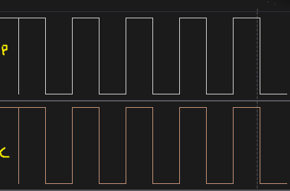
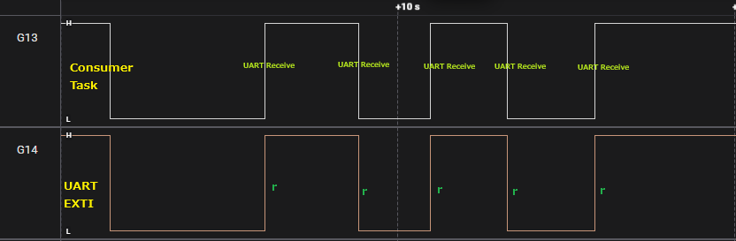
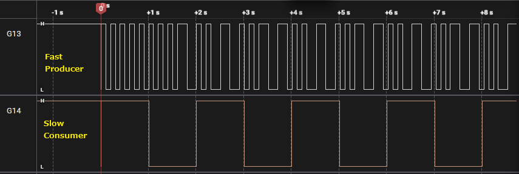

# 📘 FreeRTOS Stream Buffers

[](https://www.youtube.com/watch?v=f9ZCi5Y4fpQ) 

## 🔹 What are Stream Buffers?

Stream buffers in FreeRTOS provide a **lightweight**, **one-way communication channel** for passing a stream of bytes between a single `writer (producer)` and a single `reader (consumer)`.

They are especially useful for:
* **Single writer, single reader:** Only one task/ISR may write, only one task may read.
* **Blocking support:** Tasks can block until enough bytes are available (read) or space is available (write).
* **ISR safe:** With `xStreamBufferSendFromISR()`.
* **Lightweight:** Lower RAM usage than queues.

## 🟢 Example 01: Basic Producer/Consumer
**Description**

* `ProducerTask:` Sends "Hello from Producer" into the stream buffer every 1 second.
* `ConsumerTask:` Waits until data is available and then prints it over UART.
* `GPIOs:`
    * PG13 toggles when Producer sends data.
    * PG14 toggles when Consumer receives data.

* 🧩 Creates a new stream buffer using dynamically allocated memory. 
```c
xStreamBufferCreate(size_t xStreamBufferSizeBytes, size_t xTriggerLevelBytes);
```
 - `xStreamBufferSizeBytes` → total capacity (in bytes) of the stream buffer.
 - `xTriggerLevelBytes` → the minimum number of bytes that must be available in the buffer before a task that’s blocked on reading is unblocked.

⚙️ What does xTriggerLevelBytes actually do?

When a receiver task calls:
```c
xStreamBufferReceive(xStreamBuffer, pvRxData, xMax, xTicksToWait);
```

it might have to wait until data becomes available.
 * The task stays blocked until at least `xTriggerLevelBytes` bytes are in the buffer.
 * Once the buffer contains that much data (or becomes full, or timeout occurs), the task is unblocked and can read.

So, `xTriggerLevelBytes` defines the wake-up threshold for readers waiting for data.

⚠️ Notes

* xTriggerLevelBytes must be less than or equal to xStreamBufferSizeBytes.
* If you don’t care about this threshold, just set:

`xTriggerLevelBytes = 1` → The reader unblocks as soon as any data arrives.	 

# 

**Real-World Analogy**

Think of this like a pipe: Producer pours water in, Consumer use from the other end. If Consumer doesn’t use, water stays in the pipe.

```c
#include "FreeRTOS.h"
#include "task.h"
#include "stream_buffer.h" 

#include "string.h"
/* ****************************** Stream Buffer Handle ************************* */
StreamBufferHandle_t StreamBuffer_Handle;

/* ****************************** Task Handles ********************************* */
TaskHandle_t ProducerHandle;
TaskHandle_t ConsumerHandle;

#define STREAM_BUFFER_SIZE 64
#define TRIGGER_LEVEL	   1  // check this to chnage 40 bytes. (txData bytes x 2)

/* ***************************** Task Functions ******************************** */
void ProducerTask(void* pvParameters)
{
	char* txData = "Hello from Producer.\n"; // 21 bytes

	for(;;)
	{
		HAL_UART_Transmit(&huart1, (uint8_t *)"Producing Data...\r\n", 20, HAL_MAX_DELAY);
		size_t bytesSent = xStreamBufferSend(
				StreamBuffer_Handle,
				(void *)txData,
				strlen(txData),
				pdMS_TO_TICKS(100)
		);

		if(bytesSent > 0){
			HAL_GPIO_TogglePin(GPIOG, GPIO_PIN_13); // Toggle LED on successful send (Producer)
		}

		vTaskDelay(pdMS_TO_TICKS(1000));
	}
}

void ConsumerTask(void *pvParameters)
{
	char rxBuffer[32];
	for(;;)
	{
		size_t bytesReceived = xStreamBufferReceive( // waiting for data from Producer
				StreamBuffer_Handle,
				(void*)rxBuffer,
				sizeof(rxBuffer),
				portMAX_DELAY );

		if (bytesReceived > 0) {
			HAL_GPIO_TogglePin(GPIOG, GPIO_PIN_14); // Toggle LED on successful Receive (Consumer)
			HAL_UART_Transmit(&huart1, (uint8_t*)rxBuffer, bytesReceived, HAL_MAX_DELAY);
		}
	}
}

int main(void)
{

    // ....

    /* ************************** Create Stream Buffer ************************** */
    StreamBuffer_Handle = xStreamBufferCreate(STREAM_BUFFER_SIZE, TRIGGER_LEVEL);
    if(StreamBuffer_Handle == NULL)
    {
        HAL_UART_Transmit(&huart1, (uint8_t *)"Stream Buffer Creation Failed\r\n", 30, HAL_MAX_DELAY);
    }else{
        HAL_UART_Transmit(&huart1, (uint8_t *)"Stream Buffer Created Successfully\r\n", 37, HAL_MAX_DELAY);
    }


    /* **************************** Create Tasks ********************************** */
    xTaskCreate(ProducerTask, "Producer", 256, NULL, 2, &ProducerHandle);
    xTaskCreate(ConsumerTask, "Consumer", 256, NULL, 2, &ConsumerHandle);

    vTaskStartScheduler();
}

```

```
Stream Buffer Created Successfully
Producing Data...
Hello from Producer.
Producing Data...
Hello from Producer.
Producing Data...
Hello from Producer.
Producing Data...
Hello from Producer.
Producing Data...
Hello from Producer.
```

## 🟡 Example 02 — ISR → Task Communication

**Description**

* UART EXTI ISR writes `"\nUART Received\n"` into the stream buffer.
* The ConsumerTask blocks, waiting for data, and prints the message when it arrives.
* GPIOs:
    * PG14 toggles inside the ISR.
    * PG13 toggles when Consumer processes the message.

**Real-World Analogy**

Think of it as a **mailbox**: ISR drops a message, the Consumer reads it when it wakes up.

```c
#include "FreeRTOS.h"
#include "task.h"
#include "stream_buffer.h"

#include "string.h"

uint8_t rx_data = 0; // Variable to store UART received data

/* *********************** Stream Buffer Configurations ************************ */
#define STREAM_BUFFER_SIZE 64
#define TRIGGER_LEVEL	   1

/* ****************************** Stream Buffer Handle ************************* */
StreamBufferHandle_t StreamBuffer_Handle;

void ConsumerTask(void *pvParameters)
{
	char rxBuffer[32];
	for(;;)
	{
		size_t bytesReceived = xStreamBufferReceive( //  Receive data from the stream buffer
				StreamBuffer_Handle,
				(void*)rxBuffer,
				sizeof(rxBuffer),
				portMAX_DELAY );

		if (bytesReceived > 0) {
			HAL_GPIO_TogglePin(GPIOG, GPIO_PIN_13); // Toggle LED on successful Receive (Consumer)
			HAL_UART_Transmit(&huart1, (uint8_t*)rxBuffer, bytesReceived, HAL_MAX_DELAY);
		}
	}
}

// This callback is called by the HAL_UART_IRQHandler when the UART receive interrupt occurs
void HAL_UART_RxCpltCallback(UART_HandleTypeDef* huart)
{

	const char *msg = "\nUART Received\n";

	if(rx_data == 'r')
	{
		BaseType_t xHigherPriorityTaskWoken = pdFALSE;

		// Send data to the stream buffer from ISR
		xStreamBufferSendFromISR(
				StreamBuffer_Handle,
				(void*) msg,
				strlen(msg),
				&xHigherPriorityTaskWoken);

		HAL_GPIO_TogglePin(GPIOG, GPIO_PIN_14);

		portEND_SWITCHING_ISR(xHigherPriorityTaskWoken);
	}

    // Restart UART Reception in Interrupt mode
	HAL_UART_Receive_IT(&huart1, &rx_data, 1);
}


int main(void)
{

    // ......

    /* ************************** Create Stream Buffer ************************** */
    StreamBuffer_Handle = xStreamBufferCreate(STREAM_BUFFER_SIZE, TRIGGER_LEVEL);
    if(StreamBuffer_Handle == NULL)
    {
    HAL_UART_Transmit(&huart1, (uint8_t *)"Stream Buffer Creation Failed\r\n", 30, HAL_MAX_DELAY);
    }else{
    HAL_UART_Transmit(&huart1, (uint8_t *)"Stream Buffer Created Successfully\r\n", 37, HAL_MAX_DELAY);
    }

    /* ************************** Create Consumer Task ************************** */
    xTaskCreate(ConsumerTask, "ConsumerTask", 256, NULL, 2, NULL);


    /* Start UART Reception in Interrupt mode */
    HAL_UART_Receive_IT(&huart1, &rx_data, 1);

    vTaskStartScheduler();
}

```



```
Stream Buffer Created Successfully
r
UART Received
r
UART Received
r
UART Received
r
UART Received
r
UART Received
```

## 🔴 Example 03 — Burst Producer vs Slow Consumer

### ⚙️ Code Behavior

**Producer (BurstProducer)**
* Sends 5 bytes at a time every 100 ms.
* Cycles through 'A', 'B', 'C', 'D', 'E'.
* If the buffer is full, not all bytes are accepted → prints: `Buffer Overflow - Not all sent`
* Toggles GPIOG Pin 13 on each send.

**Consumer (SlowConsumer)**

* Reads up to **20 bytes at a time**.
* Only reads once every **1000 ms** (1 second).
* Toggles **GPIOG Pin 14** on each read.
* Prints whatever data was in the buffer.

```c
#include "FreeRTOS.h"
#include "task.h"
#include "stream_buffer.h"

#include "string.h"

/* ****************************** Stream Buffer Handle ************************* */
StreamBufferHandle_t StreamBuffer_Handle;

/* ****************************** Task Handles ********************************* */
TaskHandle_t ProducerHandle;
TaskHandle_t ConsumerHandle;

#define STREAM_BUFFER_SIZE 64
#define TRIGGER_LEVEL	   1

/* ****************************** BurstProducer Task ******************************** */
/* ****************************** BurstProducer Task ******************************** */
void BurstProducer(void *pvParameters)
{
	uint8_t txData[5];
	uint8_t i = 0;
	char setChars[] = {'A','B','C','D','E'};

	xStreamBufferReset(StreamBuffer_Handle); // Reset Stream Buffer before using

	for(;;)
	{
		memset(txData, setChars[i] , sizeof(txData));
		// Send data to Stream Buffer
		size_t sent = xStreamBufferSend(StreamBuffer_Handle,
		                                txData,
		                                sizeof(txData),
		                                pdMS_TO_TICKS(100));

		if(sent < sizeof(txData)) {
			HAL_UART_Transmit(&huart1, (uint8_t*) "Buffer Overflow - Not all sent\n", 32, HAL_MAX_DELAY);
		}

		HAL_GPIO_TogglePin(GPIOG, GPIO_PIN_13);

		i++;
		if(i > 4) i = 0;

		vTaskDelay(pdMS_TO_TICKS(100)); // Very fast producer
	}
}

/* ****************************** SlowConsumer Task ******************************** */
void SlowConsumer(void *pvParameters)
{
	uint8_t rxData[20];
	memset(rxData, 0, sizeof(rxData));
	for(;;)
	{
		size_t recvd = xStreamBufferReceive(StreamBuffer_Handle,
		                                    rxData,
		                                    sizeof(rxData),
		                                    portMAX_DELAY);

		HAL_GPIO_TogglePin(GPIOG, GPIO_PIN_14);

		HAL_UART_Transmit(&huart1, rxData, recvd, HAL_MAX_DELAY);
		HAL_UART_Transmit(&huart1,(uint8_t*)"\n",1,HAL_MAX_DELAY);

		vTaskDelay(pdMS_TO_TICKS(1000));  // Slow consumer
	}
}

int main(void)
{
  /* ************************** Create Stream Buffer ************************** */
  StreamBuffer_Handle = xStreamBufferCreate(STREAM_BUFFER_SIZE, TRIGGER_LEVEL);
  if(StreamBuffer_Handle == NULL)
  {
	  HAL_UART_Transmit(&huart1, (uint8_t *)"Stream Buffer Creation Failed\n", 30, HAL_MAX_DELAY);
  }else{
	  HAL_UART_Transmit(&huart1, (uint8_t *)"Stream Buffer Created Successfully\n", 37, HAL_MAX_DELAY);
  }


  /* **************************** Create Tasks ********************************** */
  xTaskCreate(BurstProducer, "Producer", 256, NULL, 2, &ProducerHandle);
  xTaskCreate(SlowConsumer,  "Consumer", 256, NULL, 2, &ConsumerHandle);

  vTaskStartScheduler();  
}
```


```
Stream Buffer Created Successfully
PAAAAA
BBBBBCCCCCDDDDDEEEEE
Buffer Overflow - Not all sent
AAAAABBBBBCCCCCDDDDD
Buffer Overflow - Not all sent
Buffer Overflow - Not all sent
Buffer Overflow - Not all sent
EEEEEAAAAABBBBBCCCCC
Buffer Overflow - Not all sent
Buffer Overflow - Not all sent
Buffer Overflow - Not all sent
DDDDDEEEEEAAAAABBBBB
Buffer Overflow - Not all sent
Buffer Overflow - Not all sent
Buffer Overflow - Not all sent
CCCCDDDDDEEEEEAAAAAB
Buffer Overflow - Not all sent
Buffer Overflow - Not all sent
Buffer Overflow - Not all sent
BBBBAAAAABBBBBCCCCCD
Buffer Overflow - Not all sent
Buffer Overflow - Not all sent
Buffer Overflow - Not all sent
DDDDCCCCCDDDDDEEEEEA
Buffer Overflow - Not all sent
Buffer Overflow - Not all sent
Buffer Overflow - Not all sent
AAAAEEEEEAAAAABBBBBC
Buffer Overflow - Not all sent
Buffer Overflow - Not all sent
Buffer Overflow - Not all sent
CCCCBBBBBCCCCCDDDDDE
```

----------------------------

📝 Explanation of Output
1. First Message: "PAAAAA"

    * The very first consumer read has a stray character (`P`).
    * This happens because the stream buffer memory isn’t cleared at creation.
    * After this first read, only valid producer data is seen.
    * First read often starts with random leftover SRAM content (P) because the buffer was reset and not fully flushed before the first burst. Afterward, the data stabilizes to clean sequences (AAAAA, BBBBB, etc).

2. Consumer Reads in Bursts

    * Since the consumer reads once per second, by then the producer has already sent 10 bursts of 5 bytes = 50 bytes.
    * But the stream buffer (capacity ~20 bytes) can’t hold all of that → only the most recent data is retained.
    * That’s why the consumer prints long mixed sequences like:
    ```
    BBBBBCCCCCDDDDDEEEEE
    ```
    or
    ```
    EEEEEAAAAABBBBBCCCCC
    ```
    * These sequences are concatenated 5-byte chunks, picked up in the exact order they were written into the circular buffer.

3. Buffer Overflow Messages
    * Between each consumer read, the producer keeps sending 5-byte chunks every 100 ms.
    * After just 4 bursts (20 bytes), the buffer is full.
    * Every new send attempt while the consumer hasn’t read yet → "Buffer Overflow - Not all sent". wait extra `100ms`
    * That’s why you see multiple "Buffer Overflow" lines between consumer prints.

4. Rolling Pattern
    * Notice how every consumer print looks like a rotating sliding window of A, B, C, D, E.
    * Example sequence:
    ```
    BBBBBCCCCCDDDDDEEEEE
    EEEEEAAAAABBBBBCCCCC
    DDDDDEEEEEAAAAABBBBB
    ```
    * This is the natural result of the circular buffer overwriting and wrapping around.

5. Why Characters Shift

    ```
    CCCCDDDDDEEEEEAAAAAB
    BBBBAAAAABBBBBCCCCCD
    ```
    * Consumer sometimes starts mid-burst due to timing misalignment:
        * Producer has already written multiple bursts into the circular buffer.
        * Consumer reads from the current read pointer, which may point into the middle of a chunk.
    * Example: Instead of CCCCC, the consumer read begins on the 4th C, giving CCCCDDDDD....
    * This explains the apparent character shifting.
    